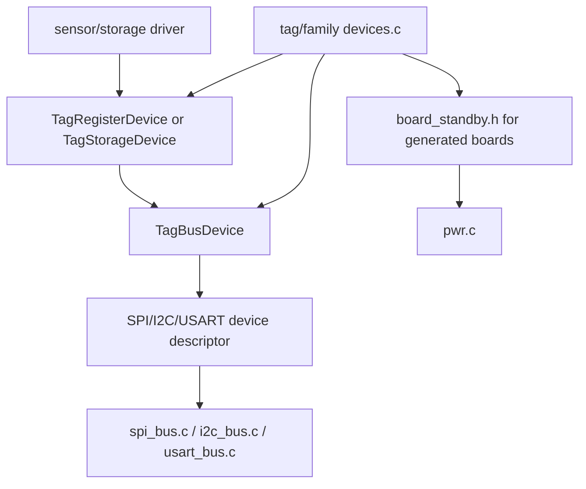
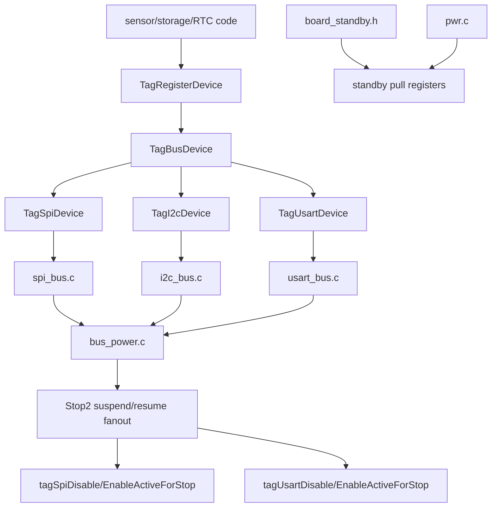

# Core Runtime

`core` owns the tag runtime that is not specific to one external device. It is
compiled by the `tag_core` module and is the default implementation used by
active tags unless a tag provides a same-named local override.

## Main Blocks

- `main.c`, `state_machine.c`: shared execution loop and monitor-controlled
  state transitions.
- `handlers.c`, `monitor.c`: protobuf request/ack handling and monitor-facing
  commands.
- `test.c`: monitor-facing self-test dispatcher. It iterates the
  tag/family-provided `TagTestCase` table from `test_support.h` and records
  the first non-`ALL_PASSED` result returned by a test hook.
- `persistent.c`, `stm32flash.c`: persistent state stored in internal STM32
  flash.
- `stm32adc.c`: ADC1 lifecycle, one-shot conversions, and calibrated VDD/die
  temperature measurement. It owns the ADC synchronization object internally.
- `time.c`: RTC/ticker/alarm helpers and low-power sleep entry.
- `pwr.c`: default power policy and shared RTC bus lifecycle for tags that do
  not provide local/family power code.
- `device.c`: weak defaults for tag/family device lifecycle hooks. It lets
  `pwr.c` call simple named hooks while tag or family `devices.c` files keep
  the concrete non-universal device behavior. The weak `tagDevicesInit()`
  fallback initializes legacy bus mutex globals for tags that have not yet
  moved that ownership into `devices.c`.
- `bus_power.c`: common board-line helpers for line validity, standby pulls,
  and Stop2 bus suspend/resume orchestration.
- `bus_device.h`: a tagged bus descriptor that embeds one concrete SPI, I2C,
  or USART device and exposes shared power/session/sleep helpers.
- `spi_bus.c`, `i2c_bus.c`, `usart_bus.c`: low-level bus mechanics for
  descriptor-backed devices. SPI and USART own raw byte transfers, peripheral
  setup, active-state tracking, and Stop2 suspend/resume mechanics. I2C owns
  controller setup and device power/session pin policy; register-level I2C
  transactions live with the shared register adapters in `sensor_io.c`.
- `debug_log.c`: optional monitor-readable debug-message buffer selected by
  the `debug_log` module.

## Monitor Priority

The SWD monitor runs through the Cortex-M DebugMonitor system exception. Tags
that use `tag_core` must set `DebugMonitor_IRQn` to a ChibiOS kernel-callable
priority from `CH_CFG_SYSTEM_INIT_HOOK()` in their `cfg/chconf.h`. Leaving
DebugMonitor at the reset-default high priority lets it preempt ChibiOS critical
sections while the monitor handler calls IRQ-safe kernel services, which can
corrupt scheduler context. The shared core provides `tagSystemInitHook()` and a
default `TAG_DEBUG_MONITOR_PRIORITY` of 8 for this purpose.

## Power And Bus Ownership

The standby path has two layers:

- `tagPowerInit()`: startup initialization for the shared power/RTC bus state.
  It initializes the RTC software-I2C driver and mutex owned by `pwr.c`
  instead of exposing that detail in `main.c`.
- `tagDevicesInit()`: startup initialization for tag-owned device runtime
  state. Modern tags define the controller semaphore storage they actually use
  in `devices.c`, such as `SPI1mutex` or `USART2mutex`, and initialize those
  semaphores here after ChibiOS startup.
- `tagDevicesPrepareStandby(state)`: protocol-level work before standby. For
  example, external flash may be woken briefly and then commanded into its
  chip-level sleep mode for final states.
- Generated boards define MCU standby pull policy in `board-customizations.json`
  with each pin's optional `Standby` field. The board build emits
  `board_standby.h`, and `pwr.c` applies those compile-time masks directly to
  the STM32 PWR pull registers. Static boards that do not generate
  `board_standby.h` still use the legacy `tagDevicesApplyStandbyPins()` hook.
- `tagDevicesDisableWakeupSources()` and
  `tagDevicesConfigureWakeupSources(state, is_active)`: non-universal wakeup
  inputs such as accelerometer interrupts. The configure hook can abort the
  standby attempt if the wake input changes while the MCU is being prepared.

Tag or family `devices.c` files override those hooks directly; older tags use
the weak defaults in `device.c`.

The descriptor dependency stack looks like this:

## Bus Layer Split

The bus layer is deliberately split between cross-bus policy and concrete bus
mechanics.

- `bus_power.c` owns helpers that apply to every bus type: valid-line checks,
  legacy STM32 standby pullup/pulldown programming for static boards, and the
  top-level Stop2 suspend/resume fanout.
- `spi_bus.c`, `i2c_bus.c`, and `usart_bus.c` own the mechanics that are
  specific to each bus type: peripheral enable/disable, device power/session
  sequencing, bus pin state, standby sleep policy, and raw transfers where the
  bus supports them.
- `bus_device.h` owns cross-bus lifecycle dispatch for descriptor-backed
  devices. `TagBusDevice` embeds the concrete SPI, I2C, or USART descriptor by
  value.
- `sensor_io.c` owns register-protocol dispatch. `TagRegisterDevice` stores the
  register protocol kind and embeds the `TagBusDevice` used by that protocol.

When adding a bus feature, put code in the narrowest layer that owns the
information it needs. Board standby pulls belong in board customizations; Stop2
fanout belongs in `bus_power.c`; SPI register twiddling belongs in `spi_bus.c`;
USART synchronous mode setup belongs in `usart_bus.c`; I2C controller
configuration belongs in `i2c_bus.c`.

Power lifetime and bus lifetime are intentionally separate. For SPI devices:

- `tagSpiDevicePowerOn/Off()` lives in `spi_bus.c` and handles optional
  switched device power plus SPI pin idle state.
- `tagSpiBusBegin/End()` lives in `spi_bus.c` and handles SPI alternate
  functions, mutex ownership, and peripheral enable/disable. `End` deselects
  the device, disables the peripheral, and returns SCK/MOSI/MISO to analog.
  The device descriptor supplies the `TagSpiConfig` used for that bus session.
- `tagSpiDevicePrepareSleep()` applies standby pull policy before deep sleep.

I2C-backed devices follow the same ownership rule: `TagI2cController`
identifies the low-level driver and mutex, while `TagI2cDevice` carries the
controller, `I2CConfig`, SDA/SCL/power lines, address, timeout, and standby
pull policy. `i2c_bus.c` owns `tagI2cControllerEnable/Disable()`,
`tagI2cDevicePowerOn/Off()`, `tagI2cBusBegin/End()`, and
`tagI2cDevicePrepareSleep()`. Register-oriented I2C reads and writes live in
`sensor_io.c` beside the SPI/USART register adapters, so sensor drivers see
one `TagRegisterDevice` shape across all transports.

USART-backed sensor buses follow the same split. `TagUsartDevice` describes
the chip-select, synchronous USART pins, optional power line, peripheral,
mutex, and `TagUsartSyncConfig` used while opening the bus. SPI and USART
devices carry the low-level peripheral, optional mutex, and session config
directly, so there is no separate controller descriptor to keep synchronized.
Register-level sensor and storage code use the same device
descriptor, so chip-select and dummy-byte policy stay with the device rather
than in a second partial bus object. USART devices also carry an explicit
standby pull policy, mirroring SPI for powered-off, always-powered, and custom
sleep cases. `usart_bus.c` owns synchronous-USART register setup and
stop/resume mechanics for peripherals enabled by the tag's
`STM32_SERIAL_USE_USARTx` settings.

Short low-power sleeps call `tagDisableActiveBusesForStop()` before entering the
configured stop mode and `tagEnableActiveBusesAfterStop()` after wake.
`bus_power.c` coordinates
those calls, while `spi_bus.c` and `usart_bus.c` own the peripheral-specific
active/suspended state and register bit changes. SPI and USART tracking are
compiled for peripherals enabled by the tag's `STM32_SPI_USE_SPIx` and
`STM32_SERIAL_USE_USARTx` settings. The stop path suspends any active
configured SPI or synchronous-USART peripheral without changing device power,
chip-select ownership, or pin alternate-function setup. Code that bypasses
`tagSpiBusBegin/End()` must call `tagMarkSpiOn()` and `tagMarkSpiOff()`
itself. Tag-local synchronous-USART setup must do the same with
`tagMarkUsartOn()` and `tagMarkUsartOff()`.

## Header Guidance

`app.h` is retained as a compatibility umbrella for older code. New common code
should include the specific subsystem header it needs:

- `core_events.h`, `core_state.h`, `core_runtime.h`, `core_sync.h`
- `power.h`, `timekeeping.h`, `persistent.h`
- `adc.h`, `flash_internal.h`, `debug_log.h`

This keeps dependencies visible and makes it easier to continue shrinking
`app.h`.
