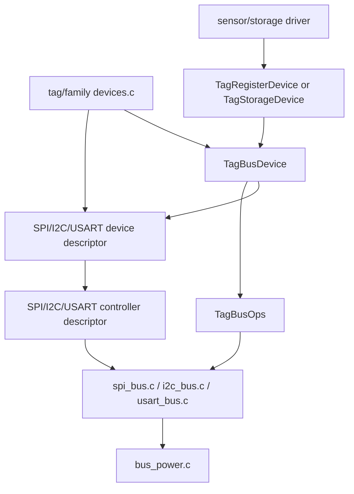
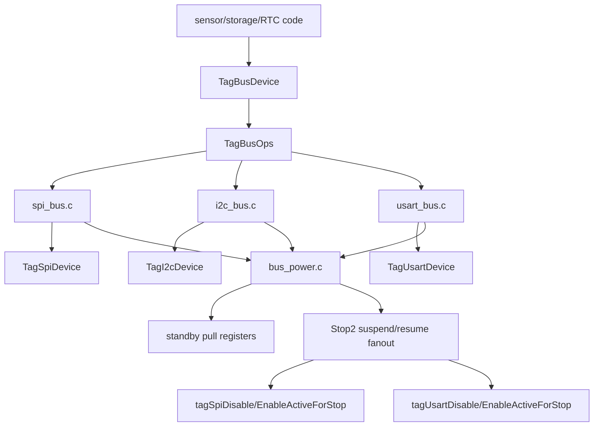

# Core Runtime

`core` owns the tag runtime that is not specific to one external device. It is
compiled by the `tag_core` module and is the default implementation used by
active tags unless a tag provides a same-named local override.

## Main Blocks

- `main.c`, `state_machine.c`: shared execution loop and monitor-controlled
  state transitions.
- `handlers.c`, `monitor.c`: protobuf request/ack handling and monitor-facing
  commands.
- `test.c`: monitor-facing self-test dispatcher. It maps protobuf `TestReq`
  values onto small device-owned hooks declared in `test_support.h`.
- `persistent.c`, `stm32flash.c`: persistent state stored in internal STM32
  flash.
- `time.c`: RTC/ticker/alarm helpers and low-power sleep entry.
- `pwr.c`: default power policy for tags that do not provide local/family
  power code.
- `device.c`: weak defaults for tag/family device standby hooks. It lets
  `pwr.c` call simple named hooks while tag or family `devices.c` files keep
  the concrete non-universal device behavior.
- `bus_power.c`: common board-line helpers for line validity, standby pulls,
  and Stop2 bus suspend/resume orchestration.
- `bus_device.h`: a small generic bus-session descriptor that binds a concrete
  SPI, I2C, or USART device pointer to the matching power/session operations.
- `spi_bus.c`, `i2c_bus.c`, `usart_bus.c`: low-level bus mechanics for
  descriptor-backed devices. SPI and USART own raw byte transfers, controller
  setup, active-state tracking, and Stop2 suspend/resume mechanics. I2C owns
  controller setup and device power/session pin policy; register-level I2C
  transactions live with the shared register adapters in `sensor_io.c`.
- `debug_log.c`: optional monitor-readable debug-message buffer selected by
  the `debug_log` module.

## Power And Bus Ownership

The standby path has two layers:

- `tagDevicesPrepareStandby(state)`: protocol-level work before standby. For
  example, external flash may be woken briefly and then commanded into its
  chip-level sleep mode for final states.
- `tagDevicesApplyStandbyPins()`: MCU pin policy before standby. This should
  only program standby pullup/pulldown state for the device pins. The lower bus
  helpers, such as `tagSpiDevicePrepareSleep()`, translate a device descriptor's
  sleep policy into the actual PWR pull registers.

Tag or family `devices.c` files override those hooks directly; older tags use
the weak empty defaults in `device.c`.

The descriptor dependency stack looks like this:

## Bus Layer Split

The bus layer is deliberately split between cross-bus policy and concrete bus
mechanics.

- `bus_power.c` owns helpers that apply to every bus type: valid-line checks,
  STM32 standby pullup/pulldown programming, and the top-level Stop2
  suspend/resume fanout.
- `spi_bus.c`, `i2c_bus.c`, and `usart_bus.c` own the mechanics that are
  specific to each bus type: controller enable/disable, device power/session
  sequencing, bus pin state, standby sleep policy, and raw transfers where the
  bus supports them.
- `bus_device.h` is the small generic adapter used by descriptor-backed
  drivers. It lets a sensor or storage driver call power/session operations
  without knowing whether the concrete device is SPI, I2C, or USART.

When adding a bus feature, put code in the narrowest layer that owns the
information it needs. Pin pull helpers and Stop2 fanout belong in
`bus_power.c`; SPI register twiddling belongs in `spi_bus.c`; USART synchronous
mode setup belongs in `usart_bus.c`; I2C controller configuration belongs in
`i2c_bus.c`.

Power lifetime and bus lifetime are intentionally separate. For SPI devices:

- `tagSpiDevicePowerOn/Off()` lives in `spi_bus.c` and handles optional
  switched device power plus SPI pin idle state.
- `tagSpiBusBegin/End()` lives in `spi_bus.c` and handles SPI alternate
  functions, mutex ownership, and controller enable/disable. `End` deselects
  the device, disables the controller, and returns SCK/MOSI/MISO to analog.
  The device descriptor supplies the `TagSpiConfig` used for that bus session.
- `tagSpiDevicePrepareSleep()` applies standby pull policy before deep sleep.

I2C-backed devices follow the same ownership rule: `TagI2cController`
identifies the low-level driver and mutex, while `TagI2cDevice` carries the
controller, `I2CConfig`, SDA/SCL/power lines, address, timeout, and standby
pull policy. `i2c_bus.c` owns `tagI2cControllerEnable/Disable()`,
`tagI2cDevicePowerOn/Off()`, `tagI2cBusBegin/End()`, and
`tagI2cDevicePrepareSleep()`. Register-oriented I2C reads and writes live in
`sensor_io.c` beside the SPI/USART register adapters, so sensor drivers see
one `TagRegisterDevice` shape across all transports.

USART-backed sensor buses follow the same split. `TagUsartDevice` describes
the chip-select, synchronous USART pins, optional power line, controller, and
`TagUsartSyncConfig` used while opening the bus. SPI and USART controllers
identify the low-level peripheral and optional mutex; the bus module's generic
controller-enable function takes the device/session config explicitly. This
keeps the config dependency visible instead of hiding it behind callback
pointers. Register-level sensor and storage code use the same device
descriptor, so chip-select and dummy-byte policy stay with the device rather
than in a second partial bus object. USART devices also carry an explicit
standby pull policy, mirroring SPI for powered-off, always-powered, and custom
sleep cases. `usart_bus.c` owns the USART2 register setup and stop/resume
mechanics.

Short Stop2 sleeps call `tagDisableActiveBusesForStop()` before entering Stop2
and `tagEnableActiveBusesAfterStop()` after wake. `bus_power.c` coordinates
those calls, while `spi_bus.c` and `usart_bus.c` own the controller-specific
active/suspended state and register bit changes. The stop path suspends any
active SPI1 or USART2 controller without changing device power, chip-select
ownership, or pin alternate-function setup. Code that bypasses
`tagSpiBusBegin/End()` must call `tagMarkSpi1On()` and `tagMarkSpi1Off()`
itself. Tag-local synchronous-USART setup must do the same with
`tagMarkUsart2On()` and `tagMarkUsart2Off()`.

## Header Guidance

`app.h` is retained as a compatibility umbrella for older code. New common code
should include the specific subsystem header it needs:

- `core_events.h`, `core_state.h`, `core_runtime.h`, `core_sync.h`
- `power.h`, `timekeeping.h`, `persistent.h`
- `adc.h`, `flash_internal.h`, `debug_log.h`

This keeps dependencies visible and makes it easier to continue shrinking
`app.h`.
