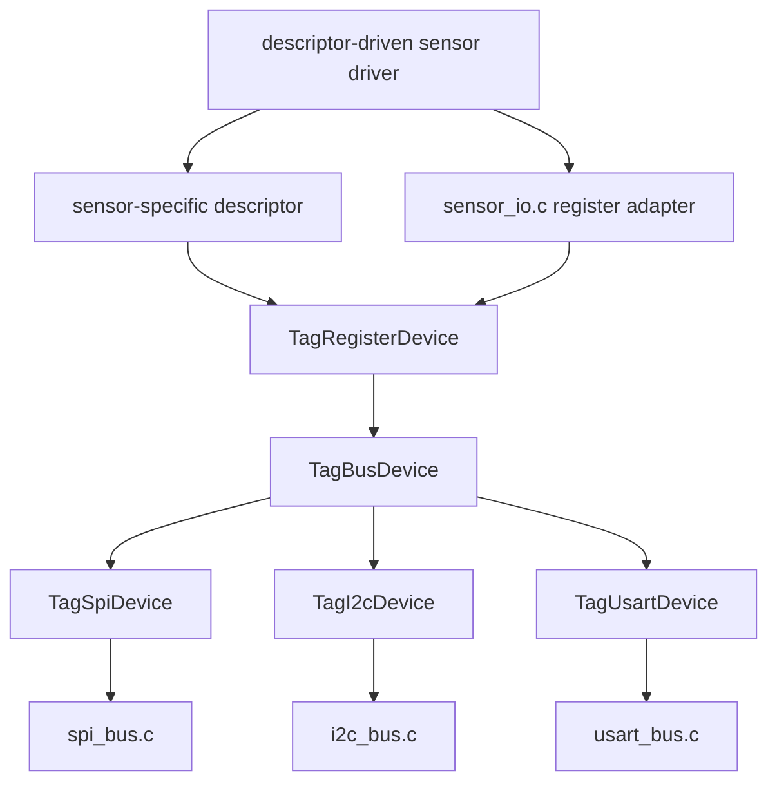

# Sensor Drivers

`sensors` contains reusable sensor drivers and sensor-side bus adapters. A
driver belongs here only when it is genuinely reusable across tags. Drivers
that encode one tag family's wakeup policy, mounting quirks, or transaction
sequence should live in that tag family instead.

## Layout

- `inc/sensor_io.h`, `src/sensor_io.c`: common register-device adapters. These
  wrap low-level bus helpers from `core` into register reads and writes used
  by sensors and other register devices such as RTCs. The active shape is
  `TagRegisterDevice`; older partial ST register-bus structs have been retired.
- `accel/`: accelerometer drivers that are reusable enough to be common.
- `pressure/`: LPS/BMP pressure drivers plus the `lps.c` compatibility shim.
- `mag/`: AK09940A descriptor driver and default shim.
- `archive/`: retired or reference sensor drivers such as MMC5633 and older
  light-sensor code. Ignore this directory unless specifically asked.

## Descriptor Pattern

Reusable drivers take a device descriptor rather than directly naming board
lines. The descriptor normally contains:

- a `TagRegisterDevice` for register reads/writes, usually including its
  `TagBusDevice` bus-session binding;
- optional sensor-specific callbacks, such as trigger or data-ready lines.

The split matters. Device power on/off is not the same as bus begin/end, and
chip select framing is part of the device protocol. Register adapters call
through the `TagBusDevice` stored in the `TagRegisterDevice`; they do not infer
the bus type from function-pointer identity. Keep command bytes and payloads
under the same chip-select assertion when the datasheet expects one
transaction.

The common dependency shape is:

## Shims

Some drivers still expose older names such as `lpsGetPressureTemp()` or
`magSample()`. Those names should live in small shim files that bind the
compiled tag's default descriptor and call the descriptor-driven implementation.
This keeps legacy call sites working while allowing new tag/family code to use
explicit descriptors directly.

## Family-Specific Drivers

The CompassTag LIS2DU12 code intentionally lives in
`families/CompassTag`, not here. Its wakeup setup and synchronous-USART
transaction framing are specialized to that family.
