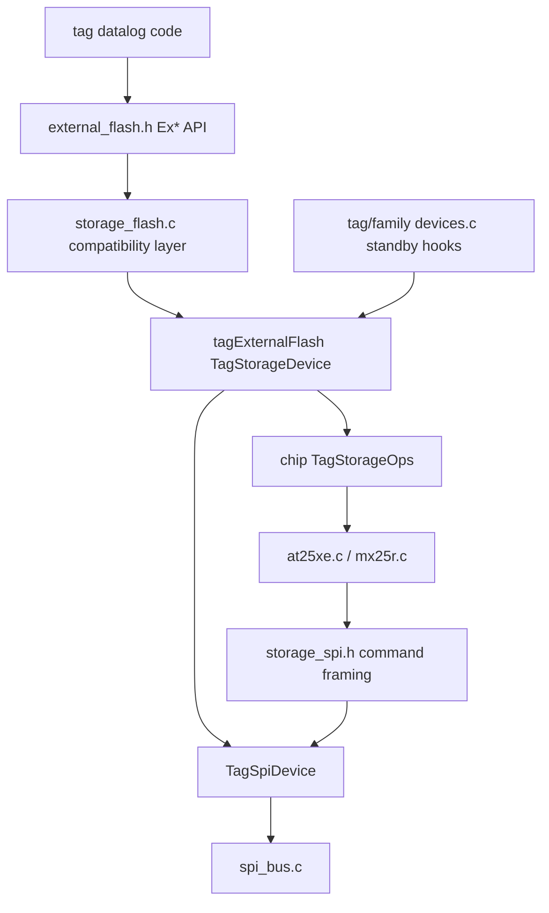

# External Storage

`storage` owns the common external-flash API and chip-specific external-memory
drivers used by logging tags.

## Public Shape

The shared runtime and tag-local datalog code call the legacy `Ex*` API from
`external_flash.h`, for example:

- `ExFlashPwrUp()` / `ExFlashPwrDown()`
- `ExCheckID()`
- `ExFlashWrite()`
- `ExFlashRead()`
- `ExFlashSectorErase()`
- `ExSectorSize()` / `ExSectorCount()`

The selected storage module chooses the chip implementation:

- `flash_at25xe` compiles `src/at25xe.c`
- `flash_mx25l` compiles `src/mx25l.c`
- `flash_mx25r` compiles `src/mx25r.c`

`external_flash_test.c` provides the shared monitor self-test hook.

## Current Architecture

Older storage drivers mix two concerns:

- chip command formats and polling rules;
- assumptions about the tag's flash bus and chip-select line.

The AT25XE driver has started moving toward the newer model by using
`storage_spi.h` for command/address/data transaction framing. That helper
intentionally uses conservative byte-at-a-time SPI transfers, even though the
core SPI layer also has pipelined stream helpers. The flash command path keeps
chip select asserted across tightly ordered command, address, and data phases,
and the byte-paced transfer matches the behavior that has tested correctly for
erase/write/read operations. AT25XE and MX25R use this helper now; MX25L still
carries local copies of similar helpers. All storage drivers still assume the
tag's flash bus and chip-select line directly, which is older than the sensor
descriptor model. It works, but it is harder to maintain than the newer split
where tag/family code owns the board descriptor and the chip driver owns only
chip commands.

`storage_device.h` is the first step toward that split. It describes the board
side of an external flash device: SPI bus, board-level enable/disable hooks, and
sector geometry. AT25XE already routes its internal chip operations through that
descriptor while preserving the existing `Ex*` API used by datalog code. MX25R
follows the same pattern.

`storage_flash.c` owns the compatibility `Ex*` functions for converted drivers.
Converted chip drivers export only a `TagStorageOps` table, while tag or family
`devices.c` files export `tagExternalFlash`. That descriptor pairs the selected
chip operation table with board wiring, board-level enable/disable hooks, and
flash geometry. Chip operations use `wake`/`sleep` for flash low-power commands
so they are not confused with board-level power enable/disable hooks. MX25L has
not yet moved to this path, so its module still provides `Ex*` directly.

Converted storage also supplies helpers used by tag/family `devices.c` standby
hooks. `tagStoragePrepareStandby()` handles chip-level standby behavior such as
entering flash sleep only for the system states where that is useful.
`tagStorageApplyStandbyPins()` handles the separate MCU standby-pin phase by
delegating through the storage descriptor to the SPI sleep policy in
`bus_power.c`. Keeping those phases separate avoids hiding device commands in
the GPIO pull configuration path.

The converted storage path is:

## Planned Cleanup

Move toward a small external-flash device descriptor that carries the SPI bus
and chip-select line. Keep each chip's command format in its own driver and
use `storage_spi.h` for common command framing. The cleanup should preserve the
current `Ex*` API until datalog users are migrated.

TODO: migrate `mx25l.c` to the same `storage_spi.h` and `TagStorageDevice`
pattern used by AT25XE and MX25R. Leave this for a separate hardware-tested
pass because MX25L currently has its own pipelined helper code and monitor debug
logging.

TODO: find and validate a safe pipelined SPI transfer routine before using
pipelined transfers as the default for shared SPI device I/O. The conservative
byte-at-a-time path is currently the known-good behavior for flash erase/write
and CompassTag calibration sensor access; any faster routine needs hardware
testing on storage, AK09940A, and LIS2DU12 use cases.
