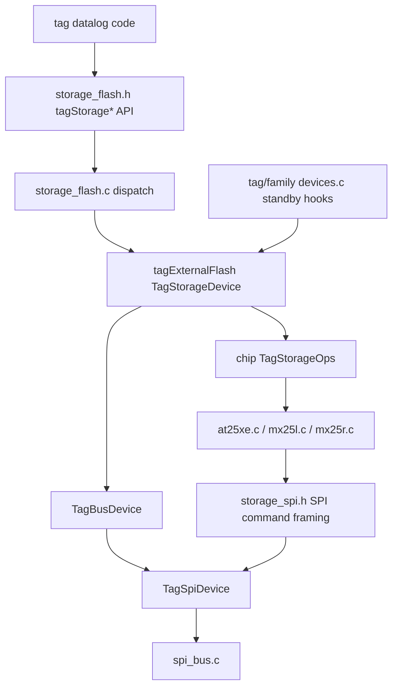

# External Storage

`storage` owns the common external-flash API and chip-specific external-memory
drivers used by logging tags. All supported external storage parts are SPI
flash devices, so this layer is intentionally SPI-specific rather than
transport-polymorphic like the sensor layer.

## Public Shape

The shared runtime and tag-local datalog code call the descriptor-based
`tagStorage*` API from `storage_flash.h`, for example:

- `tagStorageWake()` / `tagStorageSleep()`
- `tagStorageCheckID()`
- `tagStorageWrite()`
- `tagStorageRead()`
- `tagStorageSectorErase()`
- `tagStorageSectorSize()` / `tagStorageSectorCount()`

The selected storage module chooses the chip implementation:

- `flash_at25xe` compiles `src/at25xe.c`
- `flash_mx25l` compiles `src/mx25l.c`
- `flash_mx25r` compiles `src/mx25r.c`

`external_flash_test.c` provides the shared monitor self-test hook.

## Current Architecture

Older storage drivers mix two concerns:

- chip command formats and polling rules;
- assumptions about the tag's flash bus and chip-select line.

The converted drivers use `storage_spi.h` for command/address/data transaction
framing. That helper
intentionally uses conservative byte-at-a-time SPI transfers, even though the
core SPI layer also has pipelined stream helpers. The flash command path keeps
chip select asserted across tightly ordered command, address, and data phases,
and the byte-paced transfer matches the behavior that has tested correctly for
erase/write/read operations. Tag/family code owns the board descriptor and the
chip driver owns only chip commands.

`storage_device.h` describes the board side of an external flash device: SPI
bus and sector geometry. AT25XE and MX25R publish their geometry from their
chip headers, and tag or family `devices.c` files copy that into
`tagExternalFlash` rather than depending on tag-local capacity defines. Chip
drivers export only a `TagStorageOps` table, while tag or family `devices.c`
files export `tagExternalFlash`. That descriptor pairs the selected chip
operation table with board wiring and flash geometry. Chip operations use
`wake`/`sleep` for flash low-power commands so they are not confused with SPI
bus begin/end.

Converted storage also supplies helpers used by tag/family `devices.c` standby
hooks. `tagStoragePrepareStandby()` handles chip-level standby behavior such as
entering flash sleep only for the system states where that is useful.
Generated boards handle the separate MCU standby-pin phase through
`board-customizations.json` `Standby` fields and the generated
`board_standby.h` masks. `tagStorageApplyStandbyPins()` remains for static-board
fallbacks that still delegate through the storage descriptor to the SPI sleep
policy in `bus_power.c`. Keeping those phases separate avoids hiding device
commands in the GPIO pull configuration path.

The converted storage path is:

## Planned Cleanup

TODO: find and validate a safe pipelined SPI transfer routine before using
pipelined transfers as the default for shared SPI device I/O. The conservative
byte-at-a-time path is currently the known-good behavior for flash erase/write
and CompassTag calibration sensor access; any faster routine needs hardware
testing on storage, AK09940A, and LIS2DU12 use cases.
