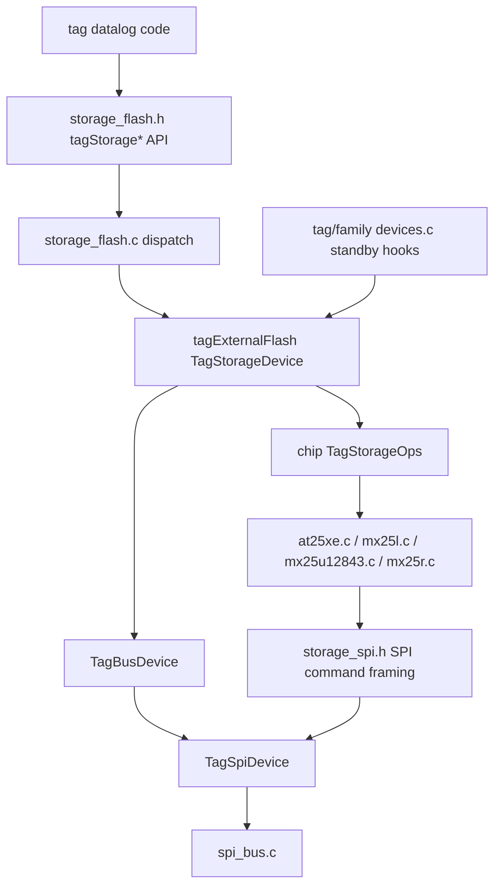

# External Storage

`storage` owns the common external-flash API and chip-specific external-memory
drivers used by logging tags. All supported external storage parts are SPI
flash devices, so this layer is intentionally SPI-specific rather than
transport-polymorphic like the sensor layer.

## Public Shape

The shared runtime and tag-local datalog code call the descriptor-based
`tagStorage*` API from `storage_flash.h`, for example:

- `tagStorageWake()` / `tagStorageSleep()`
- `tagStorageCheckID()`
- `tagStorageWrite()`
- `tagStorageRead()`
- `tagStorageSectorErase()`
- `tagStorageSectorSize()` / `tagStorageSectorCount()`

The selected storage module chooses the chip implementation:

- `flash_at25xe` compiles `src/at25xe.c`
- `flash_mx25l` compiles `src/mx25l.c`
- `flash_mx25u12843` compiles `src/mx25u12843.c`
- `flash_mx25r` compiles `src/mx25r.c`

`external_flash_test.c` provides the shared monitor self-test hook.

## Current Architecture

Older storage drivers mix two concerns:

- chip command formats and polling rules;
- assumptions about the tag's flash bus and chip-select line.

The converted drivers use `storage_spi.h` for command/address/data transaction
framing. Command and address phases intentionally use conservative
byte-at-a-time SPI transfers. Long data phases go through block-transfer hooks:
`tagStorageSpiBlockRead()` and `tagStorageSpiBlockWrite()`. By default those
hooks fall back to the conservative read/write helpers. Targets that have been
validated on hardware can opt into the DMA implementations with
`TAG_STORAGE_SPI_DMA_BLOCK_READ` and `TAG_STORAGE_SPI_DMA_BLOCK_WRITE`.
When DMA block transfers are enabled, the helper keeps the existing polled
completion path while the monitor/debugger is connected. In unattended tag
operation, `TAG_STORAGE_SPI_DMA_SLEEP_WAIT` defaults to enabled and waits for
RX DMA completion using the DMA interrupt and normal STM32 Sleep mode. This
lets the CPU sleep during the long SPI data phase without entering Stop mode,
so SPI and DMA clocks remain active. Because the shared SPI bus enables the
peripheral with low-power clocking disabled for ordinary polling transfers, the
DMA sleep wait temporarily enables the SPI and DMA sleep-mode clocks for the
active transfer and restores the previous RCC sleep-clock bits afterward.

Keeping command/address traffic conservative matters because flash protocols
depend on tightly ordered chip-select, command, address, data, and poll phases.
Keeping the long data phases behind block hooks lets a tag use DMA for 2 KiB
log pages without changing chip command code, and leaves a straightforward path
for future DMA or peripheral-specific transfer implementations.

`storage_device.h` describes the board side of an external flash device: SPI
bus and sector geometry. AT25XE, MX25U12843, and MX25R publish their geometry
from their chip headers, and tag or family `devices.c` files copy that into
`tagExternalFlash` rather than depending on tag-local capacity defines. Chip
drivers export only a `TagStorageOps` table, while tag or family `devices.c`
files export `tagExternalFlash`. That descriptor pairs the selected chip
operation table with board wiring and flash geometry. Chip operations use
`wake`/`sleep` for flash low-power commands so they are not confused with SPI
bus begin/end.

Converted storage also supplies helpers used by tag/family `devices.c` standby
hooks. `tagStoragePrepareStandby()` handles chip-level standby behavior such as
entering flash sleep only for the system states where that is useful.
Generated boards handle the separate MCU standby-pin phase through
`board-customizations.json` `Standby` fields and the generated
`board_standby.h` masks. `tagStorageApplyStandbyPins()` remains for static-board
fallbacks that still delegate through the storage descriptor to the SPI sleep
policy in `bus_power.c`. Keeping those phases separate avoids hiding device
commands in the GPIO pull configuration path.

The converted storage path is:

## Planned Cleanup

The current block DMA path is intentionally opt-in. Before enabling it on a new
tag variant, check the following:

- The target `custom.h` defines `TAG_STORAGE_SPI_DMA_BLOCK_READ` and/or
  `TAG_STORAGE_SPI_DMA_BLOCK_WRITE`.
- The target or shared family `mcuconf.h` defines `STM32_DMA_REQUIRED`, so
  ChibiOS links the STM32 DMA support code.
- The storage SPI descriptor provides valid RX and TX DMA stream IDs and DMA
  channel selections for the SPI peripheral used by external flash.
- The storage chip driver uses the common command/address helpers rather than
  a local hand-rolled read/write path, so only the large data phase is moved to
  DMA.
- Leave `TAG_STORAGE_SPI_DMA_SLEEP_WAIT` enabled for lowest-energy unattended
  transfers. Define it to `0` only when a target needs the historical polled
  wait even without a connected monitor.
- The variant has been tested on hardware for erase, write, download/readback,
  and monitor attach while logging.

Do not make DMA the shared default for all SPI device I/O. Sensor register
traffic and short flash commands should remain on the conservative path unless
they have their own measured need and hardware validation.
