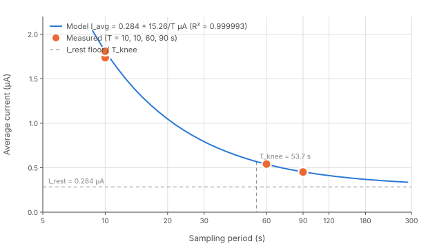

# PresTag Power Measurement Log

**Append-only.** Each completed measurement gets one entry with a timestamp,
the conditions it was taken under, and the numbers. Never edit or delete an
entry — a measurement that turned out to be wrong gets a later entry saying so,
because the wrong ones are how the reasoning is reconstructed.

Design documents cite entries from here rather than restating figures, so a
number appears once and has provenance. The companion files are
[`power-test-plan.md`](power-test-plan.md) (procedure),
[`power-test-report.md`](power-test-report.md) (the report form) and
[`power-test-status.md`](power-test-status.md) (live handoff, overwritten).

## Format

```
### YYYY-MM-DD HH:MM  <short title>
- **build**: git hash, target, notable defines
- **conditions**: period, state, window, what was attached
- **result**: the numbers
- **notes**: anything that qualifies them
```

Rig, unless an entry says otherwise: PresTagv3 + PresTag on a baseboard,
Joulescope JS320 via `joulescope_server.py --use-server`, `charge/time` figure,
supply 2.485 V, monitor and Joulescope UI detached.

---

### 2026-09-08  Baseline, before any fix
- **build**: `411b046` PresTag, stock LPTIM stop-delay path, PA2/INT1 a floating input
- **result**:
  | condition | current |
  | --- | --- |
  | IDLE, clock set (3 × 300 s) | **0.2928 µA** (0.2921 / 0.2926 / 0.2937) |
  | CONFIGURED (2 × 900 s) | **0.5165 µA** — wakes every 60.0 s, 13.4 µC per wake |
  | RUNNING, 9 s period | **530.7 µA**, flat — `godown(STOP2)` is a no-op, never sleeps |
  | RUNNING, 10 s (600 s block) | **3.6948 µA** |
  | RUNNING, 60 s (3600 s block) | **0.8552 µA** |
- **notes**: two-point fit gave `I_rest` 0.287 µA, `Q_cycle` 34.1 µC, `T_knee` 119 s.
  Fit intercept and measured idle agree to 1.9%.

### 2026-09-08  Sample event anatomy
- **build**: `411b046` + phase probe
- **conditions**: 10 s period, 0.5 ms trace
- **result**: event 59 ms, **34.9 µC**; three `stopMilliseconds()` waits at
  495 / 143 / 165 µA; `ARROK` busy-wait 6.3–7.1 ms per call for 2 ms and 5 ms
  requests alike.

### 2026-09-08  Phase C and D
- **result**: C1 scheduled start held CONFIGURED, first sample **+17 s**;
  C3 stop **−3 s**, 29 of ~30 samples; C4 `tag-stop` → FINISHED, download
  clean; C5 hibernation entry at sample 120 (block boundary, **+510 s** after
  the window opened), exit **+66 s**; all Phase D value checks PASS.
- **notes**: C5 does not discriminate the §1.7 cursor fix — its window opened at
  t+690, so the first 60-boundary is sample 120, which is also a multiple of 120.

### 2026-09-09 ~11:00  Stop 2 sleep depth, all devices off
- **build**: `ef2f6db`~ + RTC Alarm A, PA2 still a floating input
- **conditions**: 2 s delay inserted before the LPS27 is powered and before the
  AT25 is woken, so nothing on the board draws
- **result**: **143 µA** (min 133). With the AT25 explicitly awake: **167 µA**.
  Shutdown baseline in the same trace **0.290 µA**.
- **notes**: the AT25 contributes only ~24 µA. This is the measurement that
  isolated the fault to the MCU domain rather than to any device.

### 2026-09-09 ~11:30  Stop-0-cause register capture
- **conditions**: captured at the `WFE`, run at 9 s, nothing attached
- **result**: all excluded — `SLEEPDEEP=1`, `LPMS=2`, `PWREN=1`, VOS Range 2,
  `ADEN`/`ADVREGEN`/`VREFEN`/`TSEN` all 0, `HSION=0`, `PLLON=0`,
  **`C_DEBUGEN=0`**, `NVIC ISPR[0..2]` all 0, `PWR_SR1=0`, `EXTI_PR1=0`.
- **notes**: every documented cause correctly excluded, and none was the cause.

### 2026-09-09 ~12:00  PA2/INT1 made analog
- **build**: `bf0c331`
- **result**: stop-delay plateau **143 µA → 8–16 µA**;
  10 s period with the LPTIM path **2.9742 µA**, `Q_cycle` **26.82 µC**.
- **notes**: floating CMOS input near mid-rail. Invisible in Run and impossible
  in Shutdown, so only Stop 2 ever showed it.

### 2026-09-09 ~12:10  RTC Alarm A stop-delay tick
- **build**: `0ac8bc6`
- **result**: 10 s period **1.7376 µA** (180 s window), `Q_cycle` **14.49 µC**;
  event 33 ms; waits 8–16 µA.
- **verification**: `stopMilliseconds(2000)` elapses **2013.7 ms** timed from the
  RTC calendar; alarm matches read from `RTC_SSR` are exactly **2 counts** apart,
  polled and slept alike.
- **notes**: an earlier claim that these delays ran 10× long was **wrong** — it
  came from a trace whose sample events were 100 s apart at a configured 10 s
  period, misread as 20 s delays.

### 2026-09-09 ~15:00  Regression after the Alarm A change
- **build**: `ef2f6db`
- **result**: C1 start **+64 s**, C3 stop **−6 s**, download PASS (988.75–988.94 hPa,
  25.09–25.25 °C); C5 hibernation entry sample 120 (**+510 s**), exit **+59 s**,
  165 samples / 3 headers, one 759 s gap, PASS.
- **notes**: matches the pre-change behaviour. Start offset +64 s is marginally
  over the ≤60 s the minute-alarm polling predicts; was +17 s before.

### 2026-09-09 ~16:00  Sweep, measured not extrapolated
- **build**: `ef2f6db`, PA2 analog, RTC Alarm A
- **conditions**: one full 60-sample block per point
- **result**:
  | period | window | current |
  | --- | --- | --- |
  | IDLE | 300 s | **0.2810 µA** |
  | 10 s | 600 s | **1.8099 µA** |
  | 60 s | 3600 s | *pending* |
  | 90 s | 5400 s | *pending* |

### 2026-09-09 ~17:25  60 s sweep point complete
- **build**: `ef2f6db`, PA2 analog, RTC Alarm A
- **conditions**: 3600 s window (one 60-sample block); one retry on first attach
- **result**: **0.5406 µA** at 2.4853 V

### 2026-09-09 ~17:25  Interim power model fit (two Shutdown points)
- **build**: `ef2f6db`
- **points used**: 10 s → 1.8099 µA, 60 s → 0.5406 µA
- **result** (`prestag_power_model.py --point 10:1.8099 --point 60:0.5406 --capacity 5.5 --capacity 11 --target-days 365`):

  | quantity | value | note |
  | --- | --- | --- |
  | `I_rest` | **0.2867 µA** | Shutdown floor |
  | `Q_cycle` | **15.23 µC** | charge per sampling cycle |
  | `T_knee` | **53.1 s** | sampling costs as much as resting |
  | max residual | 0.000 µA | exact — two-point fit has no residual check |
  | R² | 1.000 | |

  Predicted `I_avg` and lifetime (nominal upper bound):

  | period | `I_avg` | 5.5 mAh | 11 mAh | meets 365 d? |
  | --- | --- | --- | --- | --- |
  | 10 s | 1.810 µA | 127 d | 253 d | no |
  | 60 s | 0.541 µA | 424 d | 848 d | yes |
  | **90 s** | **0.456 µA** | **502 d** | **1005 d** | **yes** |
  | ∞ | 0.287 µA | 799 d | 1598 d | — |

- **notes**: two-point fit is exact by construction — `I_rest` and `Q_cycle` determined with no
  redundancy and no residual to check. The 90 s point (in flight) will be the first independent
  check; if `I_avg(90 s)` lands near 0.456 µA the fit stands. A miss of more than ~5% means one
  of the three points is wrong and the fit is to be distrusted.

### 2026-09-09 ~20:00  Measured sweep, three full blocks
- **build**: `890a11b` PresTag — PA2 analog, RTC Alarm A ticker
- **conditions**: one full 60-sample block per point, nothing attached
- **result**:
  | period | window | current |
  | --- | --- | --- |
  | IDLE | 300 s | **0.2810 µA** |
  | 10 s | 600 s | **1.8099 µA** |
  | 60 s | 3600 s | **0.5406 µA** |
  | 90 s | 5400 s | **0.4517 µA** |
- **fit**: `I_rest` **0.2842 µA**, `Q_cycle` **15.26 µC**, `T_knee` **53.7 s**,
  max residual **0.002 µA**, **R² = 0.999993**.
- **notes**: the linear model is now measured across a 9× span rather than
  assumed from one point. The fit intercept and the directly measured idle agree
  to 1.1% — two independent routes to the same quantity.
- **lifetime at the shipped 90 s period**: 5.5 mAh **505 days**, 11 mAh **1010
  days**, against one-year budgets of 0.628 and 1.256 µA. Both met; 5.5 mAh was
  21 days short before the PA2 and Alarm A fixes.

### 2026-09-09 ~20:00  Power model chart



### 2026-09-09 ~20:30  PresTagRaw, first hardware run
- **build**: `890a11b` + `PresTagRaw/custom.h` aligned to PresTag
- **notes on what changed**: the variant had silently inherited `STANDBY` for
  all five states and the LPS27 driver defaults (10 ms power-up, up to six 15 ms
  polls) where PresTag uses `SHUTDOWN` and 5/5/1. Same board, so it already had
  the PA2 fix.
- **result**:
  | | PresTagRaw | PresTag |
  | --- | --- | --- |
  | IDLE, 300 s | **0.2792 µA** | 0.2810 µA |
  | RUN 10 s, 600 s block | **1.7746 µA** | 1.8099 µA |
  | download | **PASS** | PASS |
  | pressure | 985.13–985.56 hPa | 988.75–988.94 hPa |
  | temperature | 24.31–24.98 °C | 25.09–25.25 °C |
- **notes**: within 2% of PresTag on both currents, as expected once the configs
  match. 73 samples over 2 raw blocks, one header each, epochs monotonic. The
  raw export writes the same Pressure/Temperature/Voltage tables, so
  `prestag_check_download.py` needed no change. Pressure differs from PresTag's
  run by ~3.5 hPa because the runs are hours apart — real weather.

### 2026-09-09 ~20:15  Rig recovery — the wedged JS320 unwedged in software
- **symptom**: after the session was hard-killed mid-C6, the JS320 enumerated but
  its whole topic tree read `NOT_FOUND`, and a later attempt gave
  `jsdrv_open timed out`. The tag was dark: `Unable to get core ID` at a healthy
  2.47 V, and the monitor attach failed with `initial DEMCR read failed`.
- **result**: **repeated `USBDEVFS_RESET` ioctls recovered it** — one reset did
  nothing, three in a row with 5 s between them restored the tree. No replug and
  no root. This corrects the standing note that only a physical power cycle works.
- **notes**: after recovery `s/i/range/mode` reads **0** — sense path open, DUT
  unpowered — which is why the tag looked dead. Starting `joulescope_server.py`
  puts it back to auto and the tag comes up. The interrupted C6 run was gone:
  its transition log ended `ABORTED reason=EVENT_POWERFAIL`, exactly the
  documented consequence of a killed session.

### 2026-09-09 ~20:30  C6 — scheduled and commanded stop at the 90 s default
- **build**: `890a11b` PresTag — PA2 analog, RTC Alarm A ticker
- **C6a, scheduled stop**: run configured `period: 90`, `end_epoch` 540 s out.
  `FINISHED` recorded at **00:30:06 UTC** against a stop epoch of **00:30:05** —
  **+1 s**, reason `EVENT_ENDTIM`. Five samples at exactly 90 s spacing
  (00:22:35 … 00:28:35); the sixth was due at 00:30:05, the stop epoch itself,
  and was correctly not taken. Download **PASS** (985.06–985.19 hPa,
  24.62–24.95 °C, 2.470 V).
- **C6b, commanded stop**: open-ended run at 90 s, left alone for 330 s, then
  `tag-stop` — exit **0**, reporting `state: FINISHED` in the same reply,
  confirmed by **one** poll 1 s later. The **immediate** download succeeded, with
  no "Can't dump logs from current state". Three samples at 90 s, **PASS**
  (985.00–985.13 hPa, 24.82–24.96 °C).
- **in-run trace (no attach)**: 200 s at a 0.5 s window during C6a showed two
  wake events **exactly 90.0 s apart**, each one block, peaking 32.4 and
  29.1 µA over a 0.280 µA floor. The excess charge is
  (0.4332 − 0.280) µA × 199.5 s ÷ 2 = **15.3 µC per cycle**, against the
  `Q_cycle` of **15.26 µC** fitted from the three sweep points — an independent
  route to the same number.
- **notes**: nothing in the stop path is period-sensitive. The first attempt at
  C6a reported a spurious TIMEOUT: the poller ran `tag-info` through `grep`,
  whose output contains binary, so `grep` answered `binary file matches` and the
  state parsed as empty on all 43 polls. The tag had finished correctly at +1 s
  the whole time. `strings` before `grep`, or `grep -a`.

### 2026-09-09 ~21:15  H3 — hibernation wake cadence, and the §1.7 fix discriminated
- **build**: `890a11b` PresTag — PA2 analog, RTC Alarm A ticker
- **conditions**: `period: 10`, run 1800 s, hibernate window t+300 … t+1500.
  Chosen so the window opens **between** samples 60 and 120, which is the case
  the report says C5 could not discriminate: the corrected gate enters at
  sample 60, the old one at sample 120. Three 295 s traces at the server's
  0.5 s window, nothing attached during the run.
- **result**:

  | trace | when | mean | events | spacing | peak |
  | --- | --- | --- | --- | --- | --- |
  | A (RUNNING, 10 s) | run+60…360 | **1.8100 µA** | 29 | **10.0 s** | ~32.4 µA |
  | B (HIBERNATING) | run+660…960 | **0.3769 µA** | **5** | **60.0 s** | ~11.8 µA |
  | C (HIBERNATING) | run+1140…1440 | **0.3769 µA** | **5** | **60.0 s** | ~11.8 µA |

- **H3 verdict**: **five wake events in 295 s at exactly 60.0 s** — the minute
  alarm, twice over. An hourly alarm predicts 0–1. §1.6 is right that
  `ALARM_HOUR` behaves as `ALARM_MINUTE`.
- **A4**: HIBERNATING **0.3769 µA**, identical to four digits across two
  independent windows. A4 − A1 = **0.0841 µA** ⇒ **5.05 µC per hibernation
  wake**; the peak block gives (11.80 − 0.28) × 0.5 = 5.76 µC, and a CONFIGURED
  wake costs 13.4 µC — the hibernation wake is cheaper because it checks the
  clock without sampling.
- **§1.7 cursor fix — R1 now has real evidence**: window opened 00:48:43,
  `HIBERNATING` logged **00:53:53**, one period after sample 60 (t+600). The old
  gate would have waited for sample 120 at 01:03:43, and traces B and C would
  then have shown the 10 s cadence. They show the minute cadence. Entry is at
  the **first** 60-sample boundary at or after the window opens, as intended.
- **schedule latencies**: hibernation exit **+17 s** after the window closed
  (01:08:43 → 01:09:00; was +59 and +66 s in earlier runs), FINISHED **+7 s**
  after the end epoch.
- **download**: **PASS** — 88 samples, 2 headers, one 927 s gap **exactly at
  sample 60**, 985.00–985.75 hPa, 24.29–25.00 °C, 2.470 V.
- **notes**: trace A doubles as a validation of the method — its 1.8100 µA
  matches the independently measured 10 s sweep point of 1.8099 µA to four
  digits, so the 0.5 s block trace and the charge/time average agree.

### 2026-09-09 ~21:40  A3 — resting FINISHED
- **build**: `890a11b`
- **conditions**: tag left in FINISHED after H3's run ended; three 300 s windows
- **result**: 0.2796 / 0.2793 / 0.2782 µA → **0.2790 µA** at 2.4853 V
- **notes**: closes the last blank in Phase A. The four resting figures — IDLE
  0.2928 (A1), IDLE again 0.2860 (A5), FINISHED 0.2790 (A3), IDLE with the final
  sweep 0.2810 (A1′) — span **4.7%** across two days and two histories, against a
  20% gate. A tag left at the end of a deployment rests as deeply as one never
  started.
