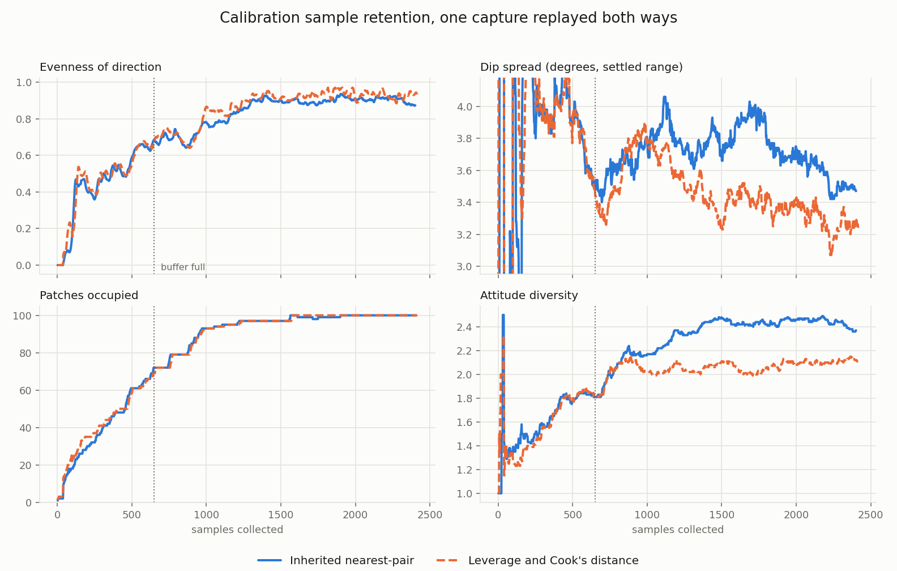
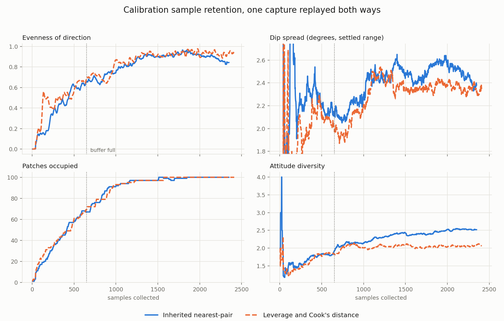

# QtCalibrate Quality Replacement: Measurements

The dated record of the experiments behind
[Replacing qtcalibrate's Calibration Quality Code](../proposals/qtcalibrate-quality-replacement.md).
Open. It holds the two captures everything was measured on, each experiment
with the log it produced, and six claims made along the way that the data
later contradicted.

The state as last measured, on the 2425-sample capture: fitting and removing
the accelerometer's zero-g offset is worth about **1.1 degrees of dip spread
under either retention policy**, and is the largest improvement measured so
far. The leverage policy beats the inherited nearest-pair scan on direction
evenness, by 0.030 against a run-to-run spread of 0.001, and loses on attitude
diversity. Its apparent dip-spread advantage did not survive a second replay
and should not be quoted.

## The data streams

Everything below comes from two capture files, both from the same
CompassTagAT25 on the same bench on 2026-10-10, both committed as
[replay fixtures](../../fixtures/qtcalibrate/README.md). Nothing here was
measured on a live tag; every run is a replay, so any run can be repeated
exactly.

| Fixture | Samples | Window (UTC) | Fitted `B` | Purpose |
| --- | --- | --- | --- | --- |
| `qtcalibrate-samples-20261010-145438.json` | 775 | 14:53:21 - 14:54:38 | 45.66 uT | Documentation baseline; first quality runs |
| `qtcalibrate-samples-20261010-163303.json` | 2425 | 16:29:00 - 16:33:03 | 45.53 uT | Retention and accelerometer comparisons |

Both carry a per-sample accelerometer vector (`has_accel` true throughout) in
calibration-stream units where 1000 is one g. The longer fixture also carries
a `tag` block identifying the firmware that produced it -- `CompassTagv1`,
githash `56e5e6a0`, built 2026-10-06, `accel_constant` 0.976,
`mag_constant` 0.01. The shorter one predates that block.

The 775-sample capture is **too short to compare retention policies**. The
buffer holds 650, so the policy only acts over the last 125 samples and fires
about 110 evictions; coverage never passes 89 of 100 patches. It is kept
because it is the documentation fixture and the first two runs used it, not
because those runs decided anything.

Both fixtures were checked against the magnetometer axis contract in
[sensor-axes.md](../../../../docs/shared/sensor-axes.md) with
`host/libraries/sensoranalysis/tools/check_orientation_frames.py` before
being committed.

The captures are indoors with the tag tethered by USB, which is why the
fitted field is 12 percent below the World Magnetic Model value and the
inclination about 3 degrees shallow. That is analysed once, in
[the proposal](../proposals/qtcalibrate-quality-replacement.md#the-calibration-environment-is-not-controllable),
and not repeated here.

### Replay logs

Each run below writes its metrics to stderr. The logs are not committed --
they are regenerable from the committed fixture at the named commit -- but
the originals are kept outside the repository in `~/Research/tag-designs/`:

| Log | Fixture | Policy | Commit |
| --- | --- | --- | --- |
| `errorlog.txt` | 775 | inherited | `e154ef10` |
| `errorlog-no-retention.txt` | 775 | inherited | `cdebc0c9` |
| `errorlog-leverage-retention.txt` | 775 | leverage | `cdebc0c9` |
| `errorlog-long-no-retention.txt` | 2425 | inherited | `cdebc0c9` |
| `errorlog-long-leverage-retention.txt` | 2425 | leverage | `cdebc0c9` |
| `errlog-acccalibrate-no-retention.txt` | 2425 | inherited | `bf15eef1` |
| `errlog-acccalibrate-retention.txt` | 2425 | leverage | `bf15eef1` |
| `errlog-acc2-no-retention.txt` | 2425 | inherited | `995ea02b` |
| `errlog-acc2-retention.txt` | 2425 | leverage | `995ea02b` |

Regenerate a pair with:

```sh
FIXTURE=host/docs/fixtures/qtcalibrate/qtcalibrate-samples-20261010-163303.json
qtcalibrate --replay-capture $FIXTURE --replay-exit --log-file inherited.txt
qtcalibrate --replay-capture $FIXTURE --replay-exit --log-file leverage.txt \
  --leverage-retention
```

`--replay-exit` starts the sweep, runs it to the end of the capture and quits;
`--log-file` writes the same lines the log window shows. Before those existed
the log was saved by hand from the window, which is why the runs below end at
different sample counts -- see experiment 7. The DEBUG lines do not reach
stdout or stderr: `main()` calls `log_set_quiet(true)`, so the only sinks are
the window and this file.

The last two runs were made from a working tree later committed as
`bf15eef1`, with one change: the saved-capture accelerometer block was moved
after `qualityUpdate()` so that the recorded offset and the quality figures
beside it describe the same buffer. That affects a saved capture's metadata
only, not any metric above.

## What was built

| Commit | What |
| --- | --- |
| `73977932` | `magPlot::reset()` called `QList::empty()`, a const query whose result was discarded, so the sample points survived every reset |
| `e3273740` | Replay fixture recaptured from current firmware; the old one predated the tag-side axis correction |
| `c721348b` | The magnetometer and accelerometer axis contract written down |
| `e154ef10` | `MagQuality`: patch coverage, direction evenness, attitude diversity, dip consistency |
| `0131c175` | The new metrics shown in qtcalibrate |
| `b1c63841` | `MagRetention`: leverage and Cook's distance in place of the nearest-pair scan |
| `cdebc0c9` | `--leverage-retention` flag, so one capture can be replayed both ways |
| `f2923035` | `GravityFit`: accelerometer zero-g offset by sphere fit |
| `bf15eef1` | The accelerometer wired into `qtcalibrate`: the offset fitted each quality tick, subtracted before `eCompass()` and before each sample's dip, shown in the window and recorded in a saved capture |

## Experiment 1: do the policies differ on the short capture?

**Result: no measurable difference, and the capture cannot answer the
question.** With 775 samples the policy acts over 125 of them.

| Policy | Coverage | Evenness | Attitude | Dip spread | Evictions |
| --- | --- | --- | --- | --- | --- |
| Inherited | 89/100 | 0.676 | 2.21 | 4.14 deg | 109 |
| Leverage | 89/100 | 0.751 | 2.16 | 4.08 deg | 112 (all leverage) |

The 0.075 evenness gap is the only signal, and on 112 evictions it is not
worth defending. This is what prompted the 2425-sample capture.

## Experiment 2: the policies on a capture long enough to decide

**Result: leverage wins on evenness by about 0.03 and on dip spread by about
0.3 degrees; it loses on attitude diversity, which turned out to be the
interesting finding.**



Final tick, and the mean over the last quarter of the run (the final tick
alone is noisy enough to mislead):

| Policy | Coverage | Evenness (final / tail) | Attitude (final / tail) | Dip spread (final / tail) | Evictions |
| --- | --- | --- | --- | --- | --- |
| Inherited | 100/100 | 0.873 / 0.906 | 2.37 / 2.44 | 3.47 / 3.61 deg | 1752 |
| Leverage | 100/100 | 0.940 / 0.934 | 2.11 / 2.10 | 3.24 / 3.31 deg | 1766 (all leverage) |

Three things to note.

**No sample was ever evicted as an outlier.** Both runs report 0 of several
thousand evictions attributed to Cook's distance. At n = 650 with p = 10 the
mean leverage is 0.015, so the textbook `D > 1` needs a residual of about 25
sigma. The threshold is not wrong so much as inapplicable at this sample
count; a 5 sigma rule is `D > 0.04`.

**The improvement continues long after the buffer fills.** Evenness is 0.68
(inherited) and 0.67 (leverage) at sample 650, where the buffer fills, and
0.900 and 0.913 by sample 1500. More than half the climb happens after the
buffer is full, which matters for what the user interface tells the operator
to do: filling the buffer is not the end of useful collection.

**Attitude diversity falls under leverage** -- 2.10 against 2.44 -- and keeps
falling as samples accumulate. Followed up in experiment 5.

## Experiment 3: the accelerometer zero-g offset, fitted offline

**Result: 76 to 78 mg, dominated by the z axis, on both captures
independently.**

A sphere fit on the raw accelerometer samples, two passes, wide gate then a
gate on the corrected magnitude:

| Fixture | Samples used | Offset (mg) | Magnitude | Radius | Residual |
| --- | --- | --- | --- | --- | --- |
| 775 | 687 of 775 | (-29.1, +2.0, -72.6) | 78.2 mg | 995.0 mg | 32.4 mg |
| 2425 | 2223 of 2425 | (-31.8, +5.0, -68.7) | 75.9 mg | 993.7 mg | 31.3 mg |

The two captures agree to 2.3 mg, and the fitted radius is within 0.7 percent
of one g, so the factory sensitivity constant is already right and only the
offset is worth removing. The LIS2DU12 datasheet gives +/- 11 mg typical zero-g
offset for the bare part; 76 mg is seven times that, which is consistent with
solder and package stress on a board-mounted part rather than with a datasheet
violation.

The offset is perpendicular to the board, which is the worst place for it.
Projected onto the orientations actually sampled in the 2425 capture it
produces a tilt of 3.4 degrees mean, 4.7 degrees worst case. Because the
tilt's direction rotates with the tag while its magnitude stays nearly
constant, it appears as dip **scatter**, not as dip bias -- which is why the
dip mean was already correct to 0.16 degrees between captures while the
spread was 3.5 degrees.

Predicted removal, subtracting in quadrature from the experiment 2 results:
2.53 degrees under the inherited policy, 2.22 under leverage.

## Experiment 4: accelerometer calibration wired in

**Result: 1.1 degrees of dip spread removed under both policies, matching
the offline prediction. The policies' dip-spread gap narrows from 0.31 to
0.15 degrees but does not close.**



| Policy | Coverage | Evenness (final / tail) | Attitude (final / tail) | Dip spread (final / tail) | Evictions |
| --- | --- | --- | --- | --- | --- |
| Inherited | 100/100 | 0.843 / 0.903 | 2.52 / 2.50 | 2.38 / 2.52 deg | 1699 |
| Leverage | 100/100 | 0.934 / 0.935 | 2.07 / 2.06 | 2.36 / 2.36 deg | 1761 (all leverage) |

Against experiment 2, by tail mean: dip spread 3.61 to 2.52 (inherited) and
3.31 to 2.36 (leverage). Evenness and attitude diversity are unchanged within
noise, as they should be -- both are magnetometer-geometry measures and the
accelerometer does not enter them.

Two defects in the plotting tool surfaced here, both fixed before the figures
above were generated.

The dip panel had a fixed 2.5 to 6.0 degree window, chosen when the steady
state was 3.5. The correction moved the whole curve below the floor and
emptied the panel. The window is now taken from the data after the buffer
fills.

The x axis was wrong for the first 650 samples of every figure drawn before
this. It counted quality ticks, assuming one per sample; the tick actually
fires every **second** sample, so the pre-fill half of the axis was
compressed by about two and the "buffer full" marker sat at sample 650 while
the curve reached its first eviction at 328. The axis is now the gate line's
holdings plus the eviction count, which is exact on both sides of the join
and puts the first eviction at 651 as it should. Nothing in the comparisons
changes -- the error was identical in both runs of each pair -- but the
absolute sample numbers read off earlier figures were wrong below 650.

**The curve changed shape, not just level.** Before the correction dip spread
fell monotonically from about 4 degrees. After it, it reaches a minimum just
past the buffer-full point -- 2.05 degrees at sample 741 inherited, 1.87 at
sample 711 under leverage -- and then climbs to 2.48 and 2.35 beyond sample
2000. That inversion is what should happen once the dominant error is gone:
early in a capture the sample cloud is concentrated, so the inclination
estimate looks tight by construction, and as coverage spreads over the sphere
the spread grows to its honest value. The old 3.5 degree floor was hiding it,
and it is a caution against reading an early dip number as a good one.

## Experiment 5: why attitude diversity goes the wrong way

**Result: not a defect in the retention policy. The leverage criterion is
structurally blind to the motion attitude diversity measures, and the metric
is being read off the wrong population.**

Leverage is computed on the ten-element magnetometer design vector. Rotating
the tag about the field axis leaves the field unchanged in body coordinates --
that is what makes it the field axis -- so the design vector is unchanged and
the leverage is identical. The policy sees a duplicate and evicts it. That
same rotation is the only motion that fills new gravity cells within one
magnetometer patch. The two measures are orthogonal by construction, and the
policy is correct by its own objective: it is discarding attitude variety that
carries no magnetometer information.

The metric's range is also much narrower than it looks. Field and gravity are
separated by a fixed angle at any site -- 90 + 63.6 = 153.6 degrees here -- so
within one magnetometer patch the gravity direction is confined to a small
circle, not the whole sphere. Tracing that circle against the Fibonacci
lattice over 400 random field directions:

| Gravity patches | Reachable cells per magnetometer patch |
| --- | --- |
| 16 (current) | 3.56 (range 2 - 5) |
| 32 | 5.21 |
| 64 | 7.51 |

So the useful range is about 1 to 3.5, not 1 to 16. The observed 2.50 and 2.06
are 70 and 58 percent of achievable -- a far larger gap than the raw numbers
suggest, and a number with a meaningful 1.0 if divided by a ceiling computed
from the measured dip.

`attitudeCells`, the unnormalised count, is already computed but not logged.
`withGravity`, the denominator, is neither logged nor exposed.

## Experiment 6: the coupling, measured

**Result: confirmed. The two policies converge on offsets 3.05 mg apart, and
both sit about 4 mg from the unbiased answer -- 0.23 degrees of tilt, the same
order as the dip-spread differences being argued about.**

`CompassData::fitGravity()` iterated the magnetometer buffer gated on
`magcal.valid[i]`, so the accelerometer calibration was fed whatever survived
the **magnetometer's** retention policy. By the argument in experiment 5 the
samples that policy evicts first are the rotation-about-the-field ones, which
are the most informative for a gravity sphere fit, and a sphere fit's centre
does move under uneven direction coverage.

Logs `errlog-acc2-*`, at `995ea02b`:

| Policy | Offset (mg) | Magnitude | Radius | Readings used |
| --- | --- | --- | --- | --- |
| Inherited | (-28.99, +6.14, -66.03) | 72.37 mg | 990.8 | 580 |
| Leverage | (-28.56, +3.26, -66.94) | 72.86 mg | 992.5 | 598 |
| Offline, whole capture | (-31.79, +5.02, -68.74) | 75.90 mg | 993.7 | 2223 |

The two policies differ from each other by 3.05 mg and from the whole-capture
fit by 4.05 and 4.10 mg. `AccelCalibration` on the same capture, holding 256
readings chosen by direction rather than by the magnetometer, lands within
1.6 mg of the whole-capture fit -- so the error here is the coupling, not the
sample count.

`residual` reads 0.00 on every tick of both logs. `GravityFit` never assigned
it; see the withdrawn claims below.

## Experiment 7: how much of this is run-to-run noise

**Result: enough to have invented the dip-spread result. Replaying one capture
twice under one policy moves the dip spread by up to 0.13 degrees, which is
larger than the policy gap that survived experiment 4.**

The replay was not reproducible, for three reasons, all now fixed in
`382c879d`.

The largest was not in the code at all. The log is saved by clicking **Save
Log**, so a run ends wherever the operator happened to click: 1758 against
1699 evictions under the inherited policy is 2408 samples against 2349, out of
2425 in the capture. Neither run reached the end.

The inherited policy also broke ties with `std::rand()`, and the quality tick
ran on its own 200 ms timer against the 100 ms sample tick, so which sample a
given line described drifted with scheduler jitter.

Tail means over the last quarter, same capture, same policy, two runs:

| Policy | Metric | Run 1 | Run 2 | Spread |
| --- | --- | --- | --- | --- |
| Inherited | dip spread | 2.515 | 2.381 | 0.133 |
| Inherited | evenness | 0.903 | 0.903 | 0.000 |
| Inherited | attitude | 2.495 | 2.544 | 0.049 |
| Leverage | dip spread | 2.363 | 2.389 | 0.026 |
| Leverage | evenness | 0.935 | 0.934 | 0.001 |
| Leverage | attitude | 2.061 | 2.107 | 0.046 |

Against the policy gaps measured on the newer pair:

| Metric | Inherited - leverage | Run-to-run spread | Verdict |
| --- | --- | --- | --- |
| Dip spread | -0.008 | up to 0.133 | **noise** |
| Evenness | -0.030 | 0.001 | real, 30 to 1 |
| Attitude | +0.437 | 0.049 | real, 9 to 1 |

So the leverage policy's one measured advantage is direction evenness. Its
dip-spread advantage does not survive a second replay, and the sign flips.

## Experiment 8: the attitude denominator

**Result: the denominator is identical between policies, so the attitude drop
is a real loss of cells.**

Both runs report **100 patches** carrying gravity, so `attitudeDiversity`
differs only in its numerator: 252 cells against 213, a loss of 39. Against
the 3.56 cells per patch the site geometry allows -- 356 over 100 patches --
that is 71 percent against 60 percent of achievable.

## Claims made and withdrawn

Recorded because each cost time and each would otherwise look settled.

**Two bugs claimed in `CompassProcessor::computeOrientation`.** Withdrawn. The
three lines compose to exactly one axis permutation and are correct. The
synthetic test that found the "bugs" fed an already-aligned magnetometer and
accelerometer pair, so the routine's board correction un-aligned it. A second
board disproved the claim directly.

**The evenness sag blamed on the discard policy.** Withdrawn. On the short
capture evenness peaks at 0.775 by sample 194 and troughs at 0.506 by sample
566, and the first eviction of the run is at sample 652. The whole sag happens
before any sample is discarded, so no discard policy caused it.

**The dip-spread floor blamed on the room.** Withdrawn. It was the 76 mg
accelerometer offset, as experiment 4 showed by removing 1.1 degrees of it.
The room is still responsible for the 12 percent field deficit and the shallow
inclination.

**Attitude diversity's fall blamed on the per-patch-mean denominator.**
Withdrawn, and now measured: experiment 8 shows the denominator is exactly 100
in both runs, so the fall is entirely in the numerator. The denominator is
still a poor choice -- it rewards concentration -- but it is not what happened
here.

**The leverage policy called better on dip spread.** Withdrawn. Experiment 7
shows a second replay of the same capture under the same policy moves the dip
spread by more than the gap did, and on the newer pair the gap is 0.008
degrees with the sign reversed. Direction evenness is the only advantage that
survives a repeat. The larger gap measured before the accelerometer correction
-- 0.31 degrees, against 0.13 of noise -- may still be real, but it was
measured once and should not be quoted as settled either.

**`GravityFit` reported a residual.** It never did: `Result::residual` was
left at zero because the accumulator held the sum of `|p|^2` where the
algebraic residual needs the sum of its square. Every fit since `f2923035`
reported 0.00, including both `errlog-acc2-*` logs. Fixed in `dae352c7`; the
reference capture reports 30.7 mg, which is model error rather than noise.

## Open questions

1. The numbers in experiments 2, 4, 6 and 8 were measured on runs that ended
   wherever the operator clicked, so read them as indicative rather than
   settled. They are not being repeated: every effect large enough to matter
   is far clear of the wobble -- the accelerometer correction at 1.1 degrees
   against 0.13, direction evenness at 30 to 1, attitude diversity at 9 to 1
   -- and the one claim that was not survived only as experiment 7's
   retraction. The next measurement that is worth making is the first one
   after the accelerometer is split off, on the reproducible replay.
2. Split the accelerometer into its own calibration task with its own buffer,
   patches, intake gate and retention, rather than borrowing the
   magnetometer's. The gates reject on different physics: the accelerometer
   gate rejects motion, a magnetometer outlier rejects field distortion, and
   each currently discards data the other needed.
3. Re-test the seven-parameter accelerometer fit (offset plus per-axis
   sensitivity) on an unbiased buffer. It was rejected at 30 versus 34 percent
   improvement, but that was measured on the magnetometer-pruned sample set. A
   1 percent per-axis scale error is up to 0.57 degrees of tilt, which is not
   negligible against the 2.4 degrees still being carried.
4. Recalibrate the Cook's distance threshold. `D > 0.04` is the 5 sigma rule at
   n = 650, p = 10.
5. Gate the dip metric on rotation rate rather than on acceleration magnitude.

