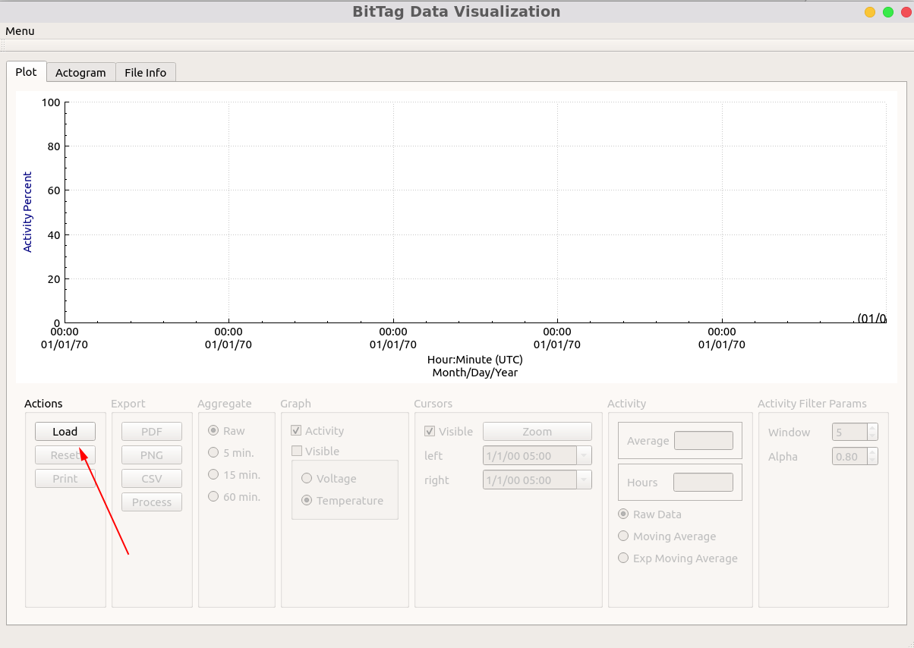
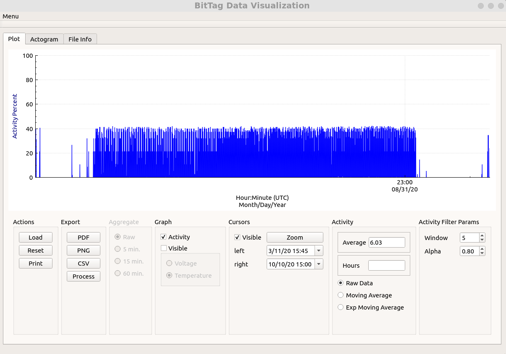
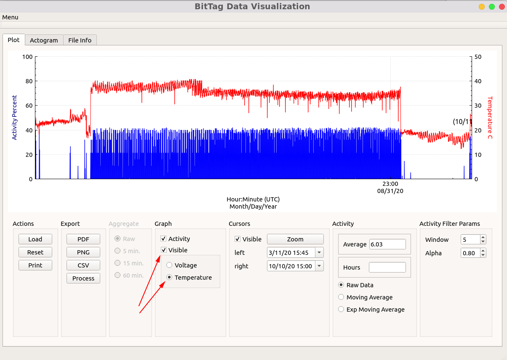
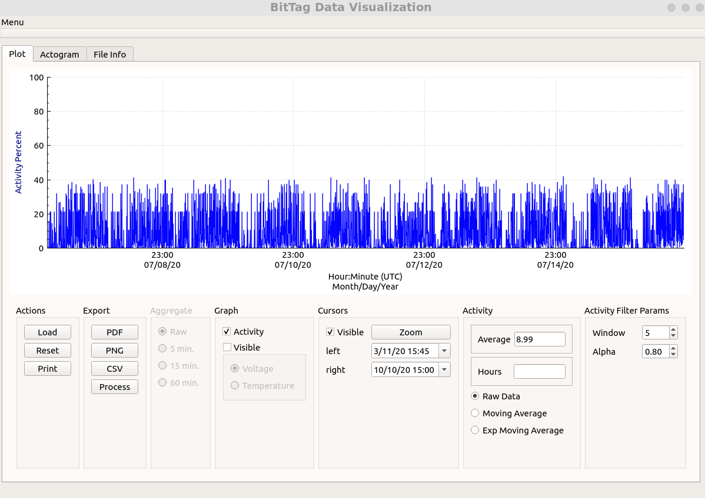
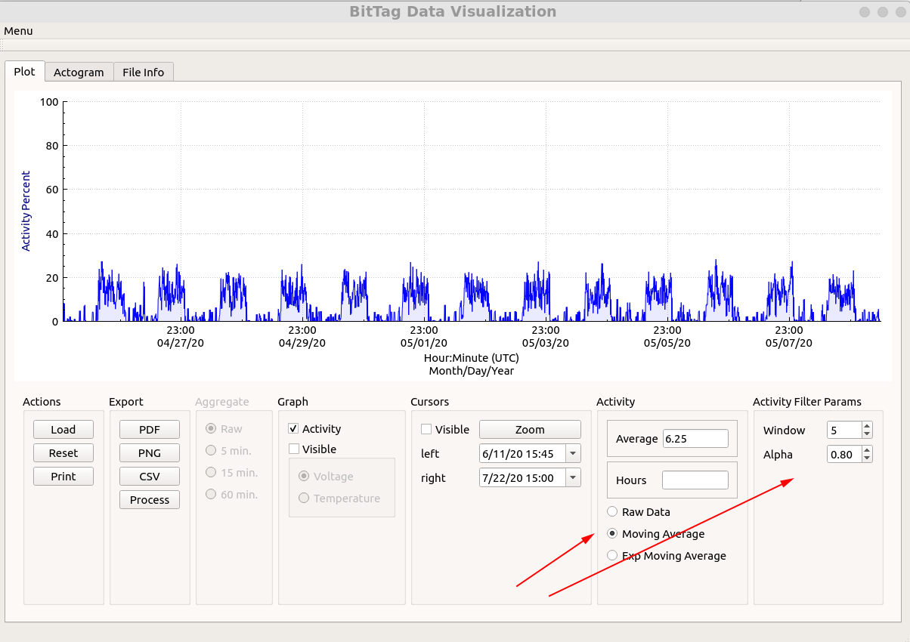
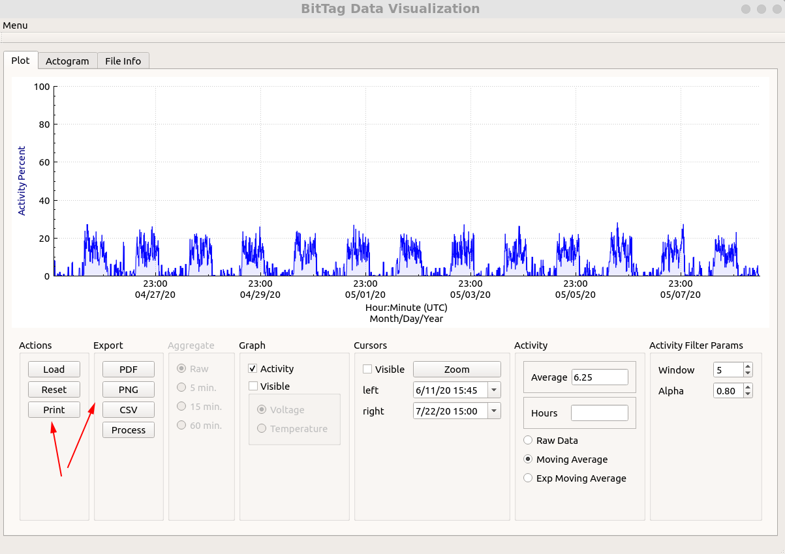
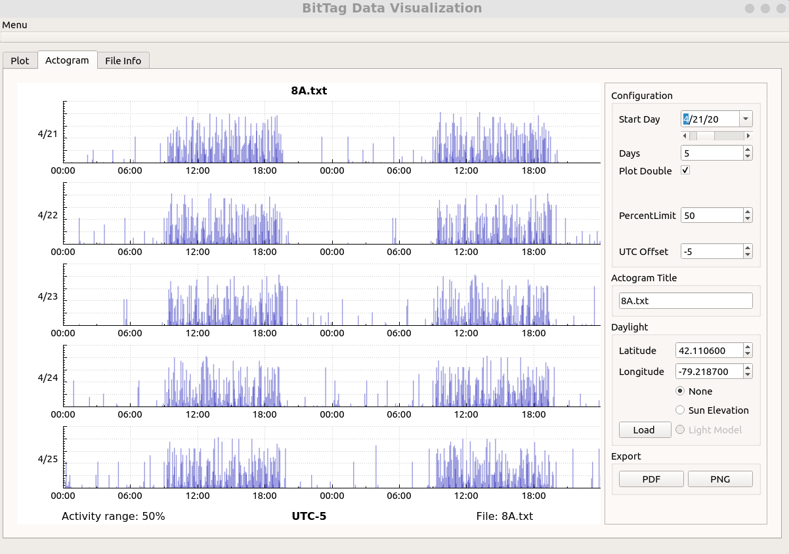
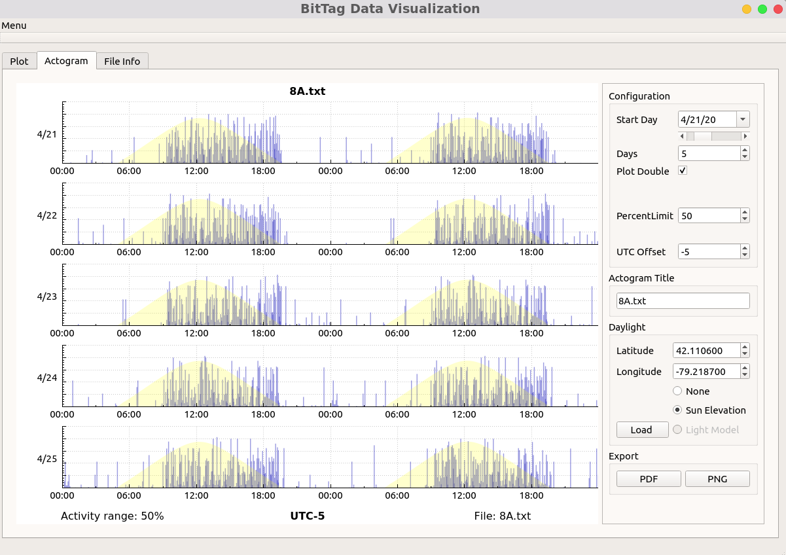
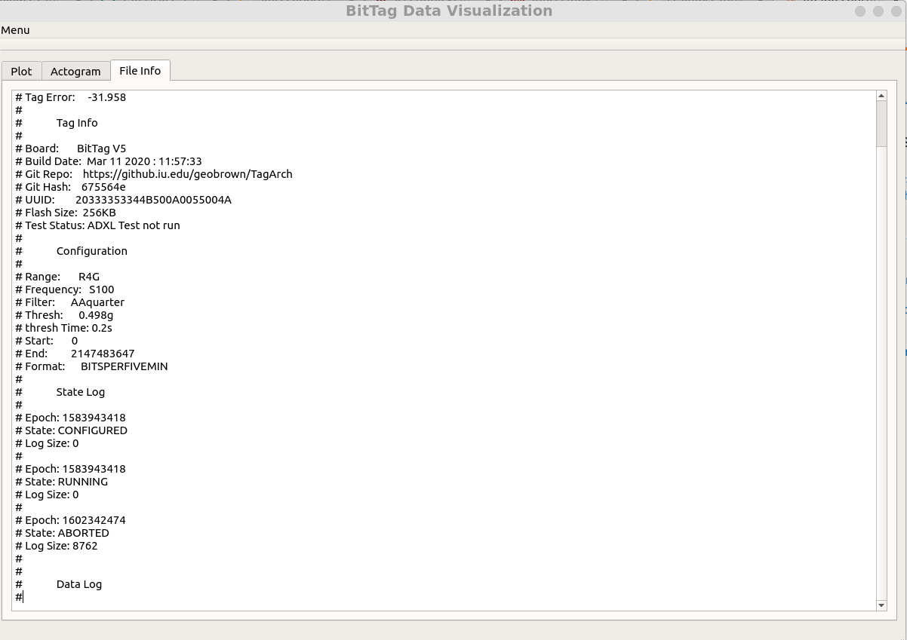

# Bit Tag Visualizer

!!! note "Legacy text files only"

    Bit Tag Visualizer applies only to the legacy BitTag `.txt` file format.
    Its role has been supplanted by [SensorViz](sensorviz.md), which is more
    general and works with the modern, portable SQLite `.db3` data format.

Bit Tag Visualizer, installed as `btviz`, is the legacy plotting tool for
human-readable BitTag monitor downloads. Use it when you need to inspect older
`.txt` data files, choose valid experiment intervals, smooth activity records,
make figures, export selected data, or build actograms.

Bit Tag Visualizer is still useful for older BitTag and BitTagNG text files,
and it can also display some legacy PresTag-style pressure files.

## Open a Data File

At startup the application shows only the load action.



1. Open Bit Tag Visualizer.
2. Select **Load**.
3. Choose a monitor-created `.txt` data file.
4. Review the loaded time range and tag metadata in the file information area.

The file dialog filters for `.txt` files because legacy BitTag monitor
downloads are human-readable text. Comment lines from the file are copied into
the file information area, except for page markers, so the experiment
configuration remains visible while you work.

After loading a BitTag activity file, the main plot shows activity over the full
recorded time span.



## Interpret Activity Percent

BitTags store activity as counts within a collection period. Bit Tag Visualizer
displays those values as an activity percentage: the count of active seconds is
divided by the collection period length in seconds, then shown on a `0-100`
activity scale.

Long records often include non-experiment intervals before deployment or after
recovery. In the example data, the quiet first and last regions are periods
where the tag was running but not attached to the animal. Use the environmental
and battery traces to help decide which intervals belong in the final analysis.

## Temperature and Voltage

Enable the **Voltage/Temperature** controls to overlay one secondary trace on
the right axis. **Temperature** uses a `0-50 C` scale, and **Voltage** uses a
`1.5-3.5 V` scale.



Temperature can be a useful deployment check. For example, a sustained body-like
temperature can help identify when a recovered tag was still on the animal,
while a return to ambient temperature can mark tag loss or post-experiment
handling. Voltage helps document battery behavior and estimate battery life.

## Zoom, Scroll, and Reset

Use the mouse, trackpad, or scroll wheel to zoom and pan horizontally through
the record. Exact gestures vary by platform, so it is worth trying the normal
scroll and pinch gestures for your operating system.



Use **Reset** to restore the full loaded time span. The activity range control
sets the visible activity maximum when the loaded file is a BitTag or BitTagNG
activity file.

## Cursors

The cursor controls mark an interval of interest. Double-click the plot with
the left mouse button to place the left cursor and with the right mouse button
to place the right cursor. On macOS, use Control-click when a right-click
gesture is not configured. You can also set cursor date and time values
directly in the cursor controls.


Select **Zoom** in the cursor panel to zoom the graph to the interval between
the two cursors. CSV export also uses the currently visible graph range, so
cursor zoom is a convenient way to select an analysis interval before exporting.

## Filter Activity Data

The **Low Pass Filter** option smooths the activity trace with a Hanning-window
FIR filter. Adjust the cutoff control to make the displayed activity curve more
or less responsive.



When filtering is enabled, the plot and actogram use the filtered activity
series. CSV export records whether it wrote raw data or low-pass filtered data,
including the selected cutoff frequency when the filter is active.

## Export Graphs and Data

The export controls operate on the current plot view.



| Export | Output |
| --- | --- |
| **Print** | Opens a print preview for the current graph. |
| **PDF** | Saves the current graph as a PDF file. |
| **PNG** | Saves the current graph as a PNG image. |
| **CSV** | Writes data from the current visible time range to CSV. |

For BitTag and BitTagNG files, CSV export writes timestamp, offset-adjusted
date/time, activity percentage, temperature, and voltage columns when those
values are present. For legacy PresTag-style files, CSV export writes pressure,
temperature, and voltage columns.

The **Read CSV** action is a separate interval-processing tool. It reads a CSV
file containing `start,stop` date/time pairs in `MM/dd/yyyy hh:mm:ss` format
using UTC times, then writes the average activity percentage for each interval.

## Actograms

The **Actogram** tab displays BitTag activity as daily rows. Use it to inspect
daily rhythms, compare days, and prepare activity figures.



Actograms can be configured with:

- start day;
- number of days;
- single-plot or double-plot display, showing either 24 or 48 hours per row;
- activity range maximum;
- UTC offset;
- title.

The actogram can be exported as PDF or PNG.

## Sun Elevation and Light Models

Actograms can be drawn without a light overlay, with natural sun elevation, or
with a lab light model loaded from CSV.



Natural light uses the configured latitude and longitude to compute sun
elevation for the activity timestamps. A lab light model is useful for captive
experiments where lights are controlled independently from local sunrise and
sunset. The lab light CSV contains UTC `start,stop` date/time pairs in
`MM/dd/yyyy hh:mm:ss` format:

```csv
04/01/2019 11:00:00,04/01/2019 23:59:59
04/02/2019 11:00:00,04/02/2019 23:59:59
04/03/2019 11:00:00,04/03/2019 23:59:59
04/04/2019 11:00:00,04/04/2019 23:59:59
04/05/2019 11:00:00,04/05/2019 23:59:59
```

Rows must be ordered, and each stop time must be later than its start time.

## Tag Metadata

Legacy text downloads include comment-line metadata describing the experiment
and tag configuration. Bit Tag Visualizer shows those lines in the file
information area so they can be reviewed alongside the plot.



Metadata can include collection periods, activity detection settings, hardware
and software versions, and final clock error. Keep this information with
figures and exported data when documenting an experiment.

## Legacy Pressure Files

When Bit Tag Visualizer detects a legacy PresTag-style file, it changes the
primary graph from activity to pressure. The graph range controls switch to hPa
values, and the altitude option converts pressure to approximate altitude in
meters. Actograms and activity filters are hidden for these files because they
are activity-specific views.
