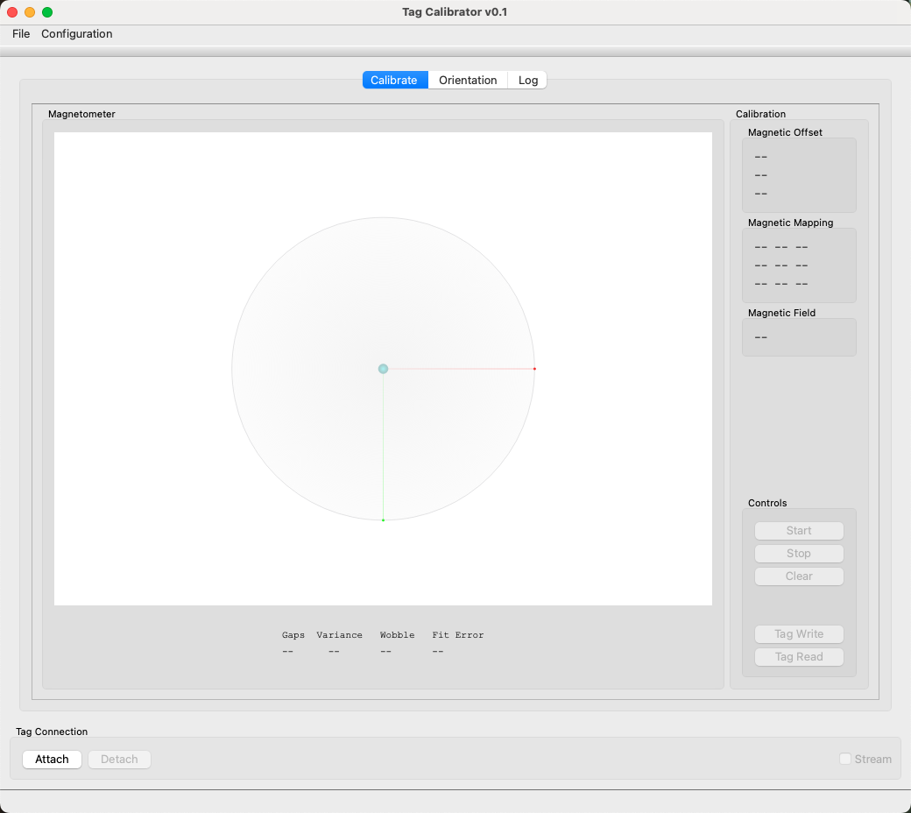
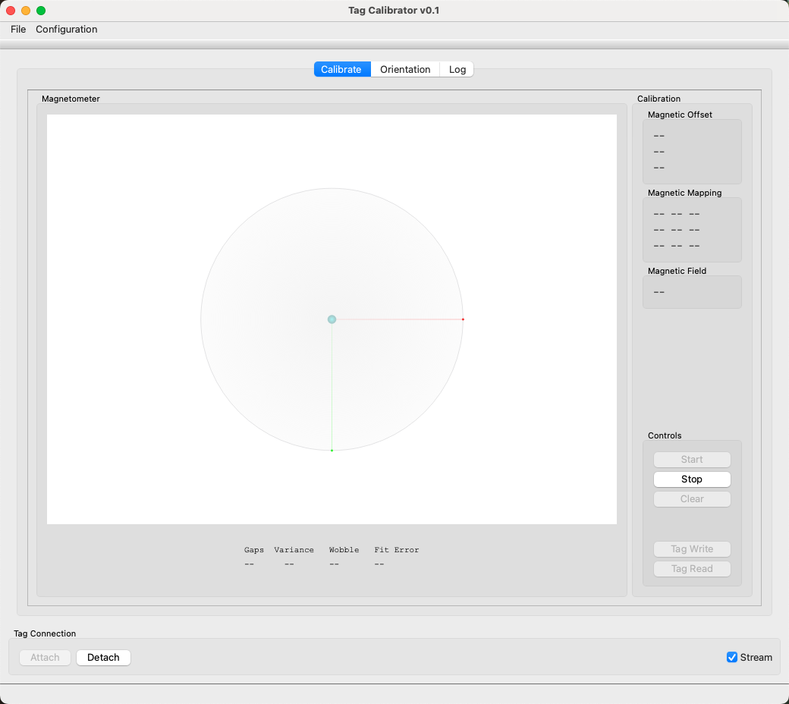
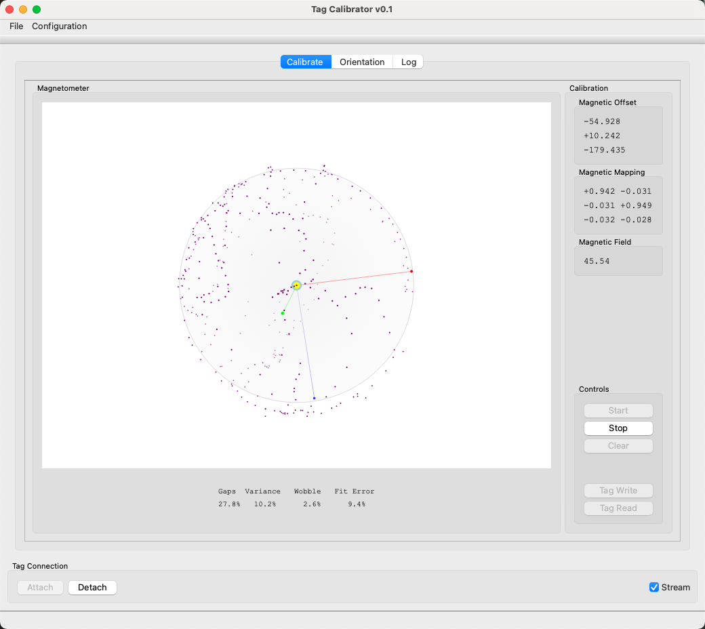
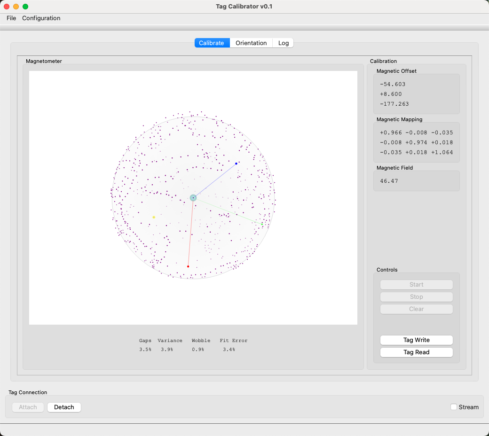
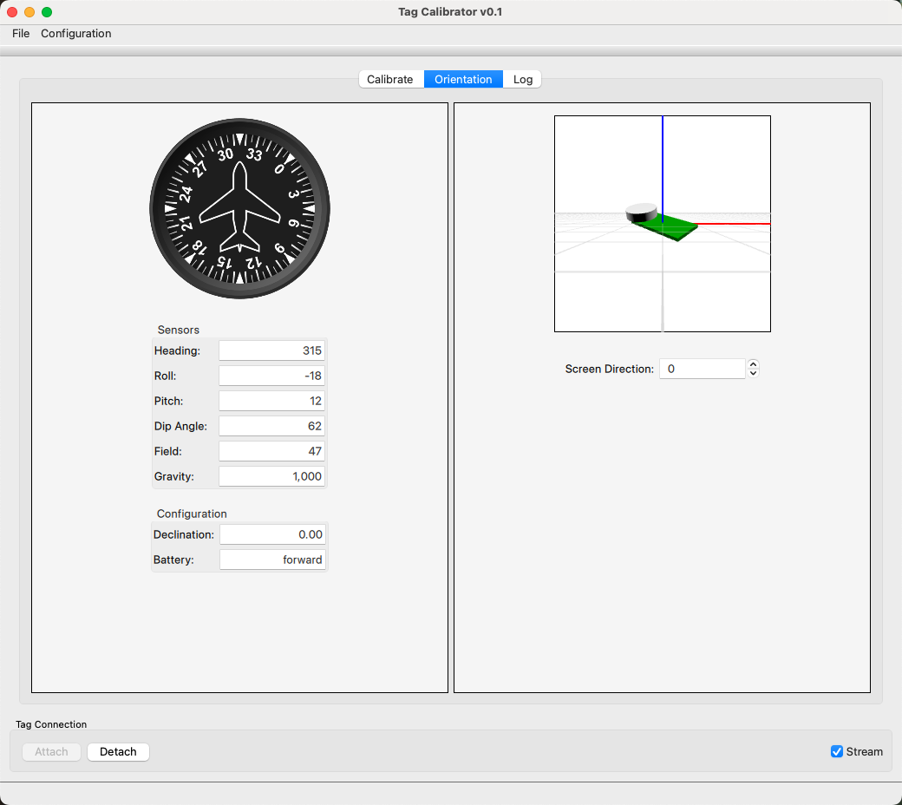
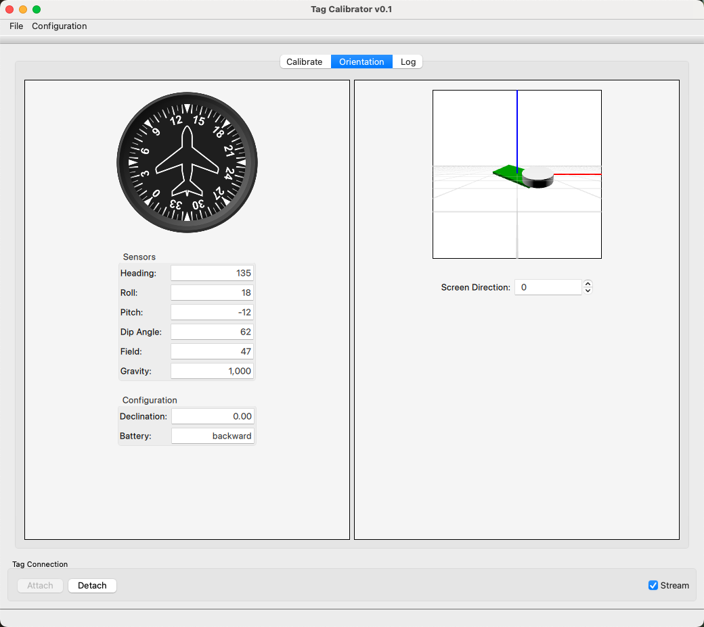

# Qt Calibrate

Use Qt Calibrate to collect calibration data and generate calibration values
for supported sensors.

## Before You Start

- Connect the tag or base station.
- Place the tag in the required starting orientation.
- Keep magnetic and motion disturbances away from the calibration area when possible.

## Run a Calibration

1. Open Qt Calibrate.
2. Select the connected device.
3. Choose the calibration mode.
4. Follow the on-screen collection sequence.
5. Review the fitted calibration results.
6. Save or apply the calibration values.



## Collection Milestones

At the start of collection, the plot is empty and the collection controls are
active.


As samples are collected, the magnetometer plot should begin covering the
sphere from many tag orientations.



Midway through collection, gaps and fit error should continue improving as the
sample cloud fills in.



At the end of collection, the fitted constants and quality metrics summarize
the calibration result.



## Check Orientation

After the calibration result is available, open the **Orientation** tab to check
the live compass heading and attitude preview. The display can use either
battery-forward convention depending on how the tag is mounted.





## Save Sample Data

Qt Calibrate captures the calibration-window sample stream while collection is
active. Press **Start** to begin collecting samples and **Stop** to finalize the
capture. After a stopped capture contains samples, use **File > Save Sample
Capture** to save a JSON archive.

The archive contains the received magnetometer samples, any paired
accelerometer samples, and the fitted calibration values when available. Use it
to preserve an example calibration session for troubleshooting or documentation
fixture work.

## Troubleshooting

!!! note "Draft section"
    Add guidance for noisy data, failed fits, orientation mistakes, and connection loss.

## Maintainer Notes

Documentation maintainers can replay a saved capture without physical tag
hardware:

```sh
qtcalibrate --replay-capture host/docs/fixtures/qtcalibrate/good-sphere-v1.json
```

To prepare a stable screenshot milestone, add `--replay-percent` with a value
such as `0`, `25`, `50`, or `100`.

To regenerate the baseline screenshots in `host/docs/src/images/`, use:

```sh
qtcalibrate --capture-startup-screenshot

qtcalibrate \
  --replay-capture host/docs/fixtures/qtcalibrate/good-sphere-v1.json \
  --capture-replay-screenshots

qtcalibrate \
  --replay-capture host/docs/fixtures/qtcalibrate/good-sphere-v1.json \
  --capture-orientation-screenshot
```

Use `--orientation-pose heading,pitch,roll,dip,field,gravity` to tune the
orientation screenshot values.
