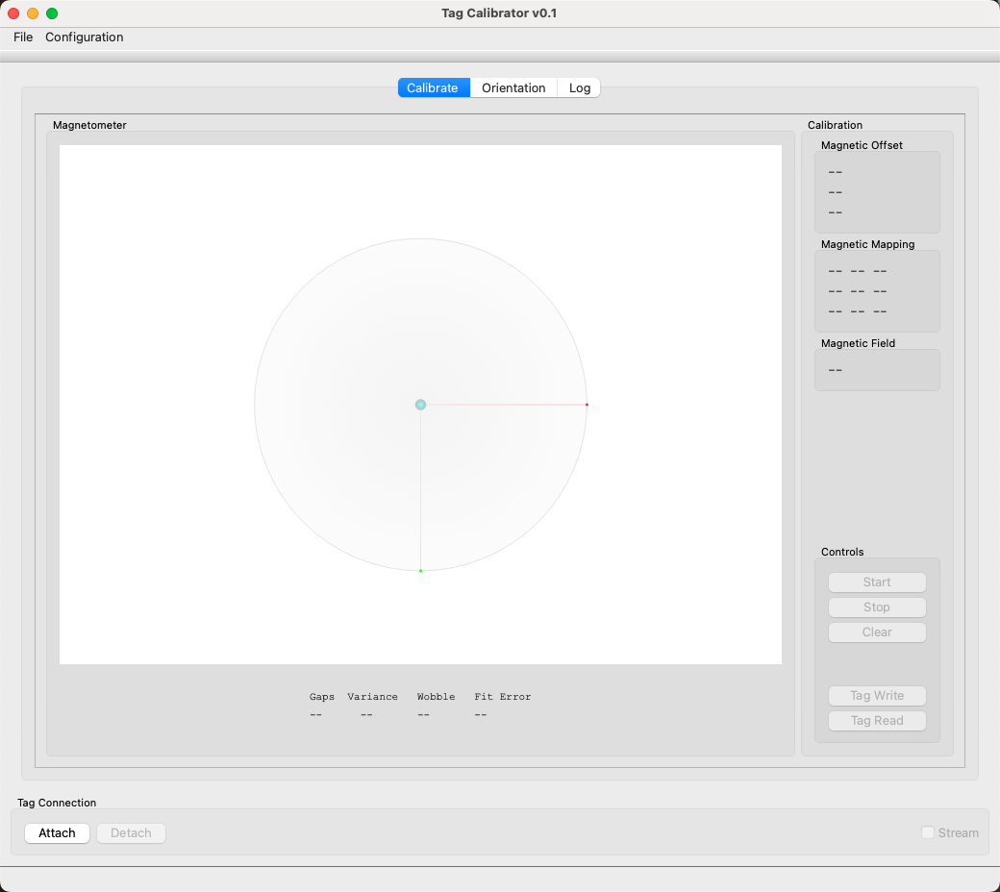
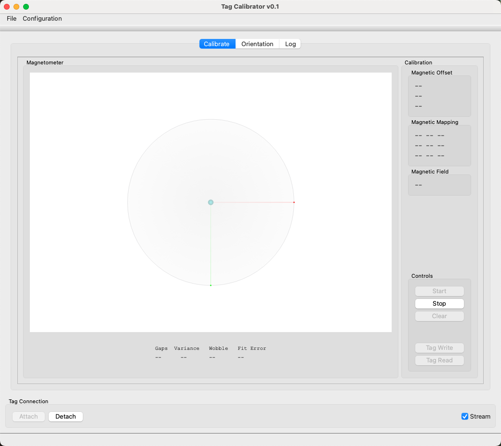
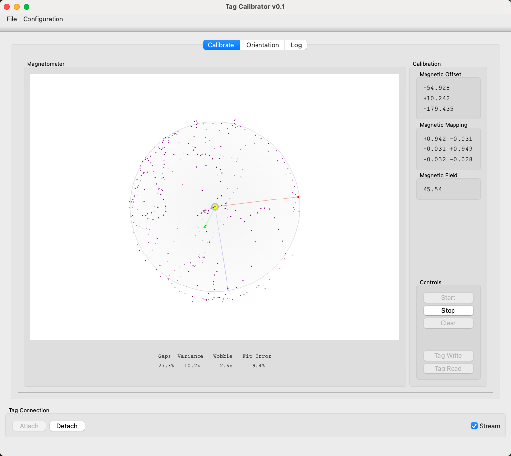
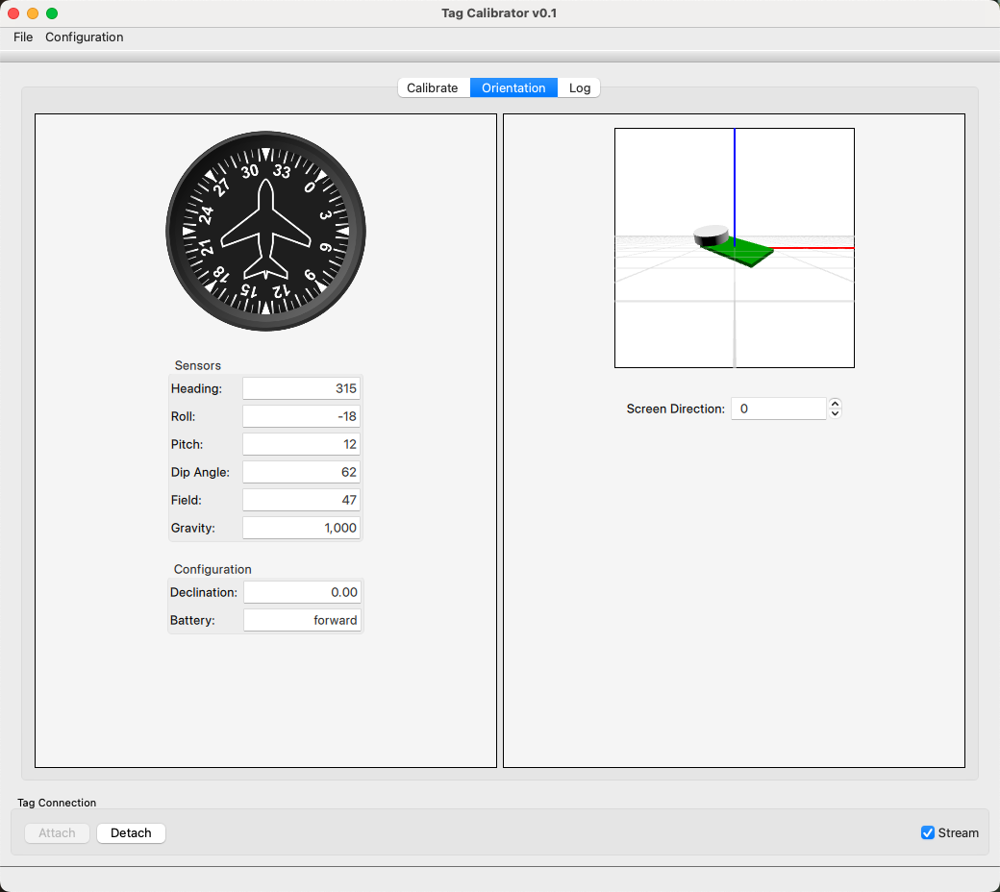
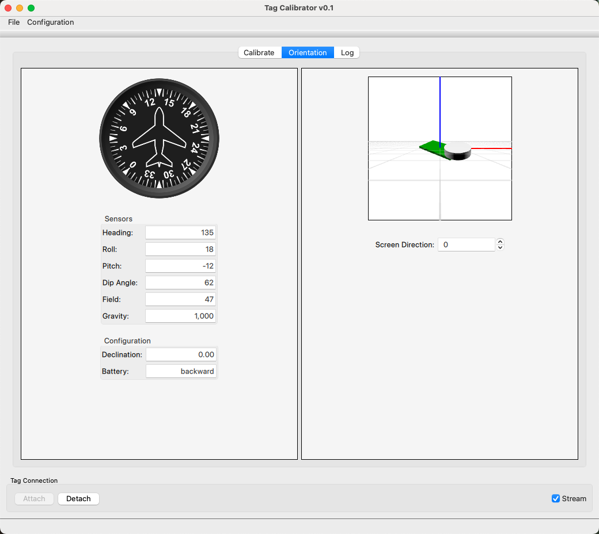

# Qt Calibrate

Use Qt Calibrate to collect calibration data and generate calibration values
for supported sensors.

## Before You Start

- Connect the tag or base station.
- Place the tag in the required starting orientation.
- Keep magnetic and motion disturbances away from the calibration area when possible.

## Run a Calibration

1. Open Qt Calibrate.
2. Select the connected device.
3. Choose the calibration mode.
4. Follow the on-screen collection sequence.
5. Review the fitted calibration results.
6. Save or apply the calibration values.



## Collection Milestones

At the start of collection, the plot is empty and the collection controls are
active.


As samples are collected, the magnetometer plot should begin covering the
sphere from many tag orientations.



Midway through collection, gaps and fit error should continue improving as the
sample cloud fills in.



At the end of collection, the fitted constants and quality metrics summarize
the calibration result. See [Reading the Results](#reading-the-results) for
what each number means.


## Reading the Results

Two panels fill in while samples arrive. **Calibration** holds the constants
that would be written to the tag. **Magnetometer** holds eight numbers that
say whether those constants are worth writing.

The plot beside them draws the sphere at the computed field, so its size on
screen tracks the **Magnetic Field** value: a weaker site draws a smaller
sphere. Points that lie on the sphere are consistent with the fit; the
scatter you can see around it is the residual the numbers below put a figure
on.

### Calibration

| Panel | What it holds |
| --- | --- |
| **Magnetic Field** | Field strength the fit settled on, in µT. The Earth's field runs from about 25 µT to 65 µT depending on where you are; a value well outside that means the fit has not converged. |
| **Magnetic Offset** | Hard iron, in µT. The steady field the tag carries with it -- its own battery and components -- which is subtracted from every reading. |
| **Magnetic Mapping** | Soft iron, a 3x3 matrix with no units. It corrects the way nearby metal stretches the field into an ellipsoid. Expect diagonal terms within a few percent of 1 and small off-diagonal terms. |
| **Accelerometer Offset** | Zero-g offset in mg, with its magnitude last. A sound tag reads about 75 mg. The word `CHECK` appears past 250 mg, which means a damaged part or a sweep that never covered enough orientations. It is used when deriving dip and orientation, and **Save** writes it to the tag with the magnetometer constants, so SensorViz applies it to the downloaded log. |

### Magnetometer: coverage

The first row says whether the sweep gave the solver enough to work with. It
updates while you turn the tag, so it is the row to watch during collection.

| Column | What it means |
| --- | --- |
| **Coverage** | Directions visited, out of 100 evenly spaced patches on the sphere. Aim to fill all of them. |
| **Evenness** | How evenly the samples are spread over directions, from 0 to 1. Near 1 is uniform; near 0 means they lie close to a single plane -- the tag was spun on a bench without ever being tipped. Coverage alone will not catch that, because the occupied patches really are spread around. |
| **Attitude** | How much the tag was rotated *about* the field direction, as the mean number of distinct gravity directions seen per magnetometer patch. At 1, every patch was reached from one attitude only, and nothing in the data pins down the off-diagonal soft-iron terms. The practical ceiling is around 3.6 at this site's inclination, because the angle between field and gravity is fixed wherever you are. |
| **Dip** | Magnetic inclination: the angle between the field and gravity, as mean ± spread. The angle belongs to the site, not to the sample, so a wide spread means the samples disagree with each other about where the field is. |

**Attitude** and **Dip** need accelerometer samples. Without them the Dip
column reads `no accel`.

### Magnetometer: residual

The second row measures how far the samples sit from the sphere that was
fitted to them, all as a percentage of the field except Hard Iron.

| Column | What it means |
| --- | --- |
| **Spread** | What a typical sample does. A robust width, so a handful of bad samples barely move it. |
| **Worst 5%** | What the bad samples do: 95% of samples are closer to the sphere than this, so one in twenty is worse. |
| **Hard Iron** | Hard iron the fit did not remove, in µT. It needs decent Coverage to mean anything -- read it with the Coverage figure above it. |
| **Fit Error** | The RMS residual, which is the number the solver itself minimises. A mean square is set by its largest residual, so outliers drag this up while Spread stays put. |

Read them together rather than one at a time:

- **Spread and Fit Error close together** -- no outliers; the residual is
  evenly distributed and the fit is as good as the numbers say.
- **Fit Error well above Spread, with a large Worst 5%** -- the bulk of the
  sweep is fine but some samples are badly wrong. Keep collecting and they may
  be dropped as the buffer fills; if the numbers do not settle, something near
  the tag is disturbing the field.
- **All three small but Coverage or Evenness low** -- the fit is tight on the
  data it has, and may still be wrong. A flat ring of samples fits many
  spheres equally well. Keep turning the tag.
- **Small residuals but a wide Dip spread** -- each sensor is self-consistent
  and the two disagree about the site. Usually a magnetic disturbance nearby,
  or a tag being swung too fast for the accelerometer to read gravity.

### Reference values

From the two captures committed as documentation fixtures, both usable sweeps.
These come from replaying each capture in full; the window shows the same
metrics over the samples the solver is holding at that moment, so a live
reading will be close but not identical.

| | Short sweep | Long sweep |
| --- | --- | --- |
| Samples | 775 | 2425 |
| Magnetic Field | 46.2 µT | 46.0 µT |
| Coverage | 90/100 | 100/100 |
| Evenness | 0.63 | 0.76 |
| Attitude | 2.26 | 3.15 |
| Dip | 63.8 ± 2.8° | 63.7 ± 2.5° |
| Spread | 0.82% | 1.08% |
| Worst 5% | 1.84% | 1.98% |
| Hard Iron | 0.55 µT | 0.51 µT |
| Fit Error | 0.94% | 1.03% |
| Accelerometer Offset | 73 mg | 69 mg |

The longer sweep has the better coverage and the tighter dip spread, and
slightly larger residuals -- more samples means more of the sensor's own noise
is in the fit, which is the honest number rather than a worse one.

## Check Orientation

After the calibration result is available, open the **Orientation** tab to check
the live compass heading and attitude preview. The display can use either
battery-forward convention depending on how the tag is mounted.





## Save Sample Data

Qt Calibrate captures the calibration-window sample stream while collection is
active. Press **Start** to begin collecting samples and **Stop** to finalize the
capture. After a stopped capture contains samples, use **File > Save Sample
Capture** to save a JSON archive.

The archive contains the received magnetometer samples, any paired
accelerometer samples, and the fitted calibration values when available. Use it
to preserve an example calibration session for troubleshooting or documentation
fixture work.

## Troubleshooting

A sweep that collects samples but produces numbers you do not trust is covered
by [Reading the Results](#reading-the-results), which says what each metric
means and what combinations of them point to.

!!! note "Draft section"
    Add guidance for failed fits, orientation mistakes, and connection loss.

## Maintainer Notes

Documentation maintainers can replay a saved capture without physical tag
hardware:

```sh
./qtcalibrate --replay-capture host/docs/fixtures/qtcalibrate/qtcalibrate-samples-20261010-145438.json
```

To prepare a stable screenshot milestone, add `--replay-percent` with a value
such as `0`, `25`, `50`, or `100`.

To regenerate the baseline screenshots in `host/docs/src/images/`, use:

```sh
./qtcalibrate --capture-startup-screenshot

./qtcalibrate \
  --replay-capture host/docs/fixtures/qtcalibrate/qtcalibrate-samples-20261010-145438.json \
  --capture-replay-screenshots

./qtcalibrate \
  --replay-capture host/docs/fixtures/qtcalibrate/qtcalibrate-samples-20261010-145438.json \
  --capture-orientation-screenshot
```

Use `--orientation-pose heading,pitch,roll,dip,field,gravity` to tune the
orientation screenshot values.
