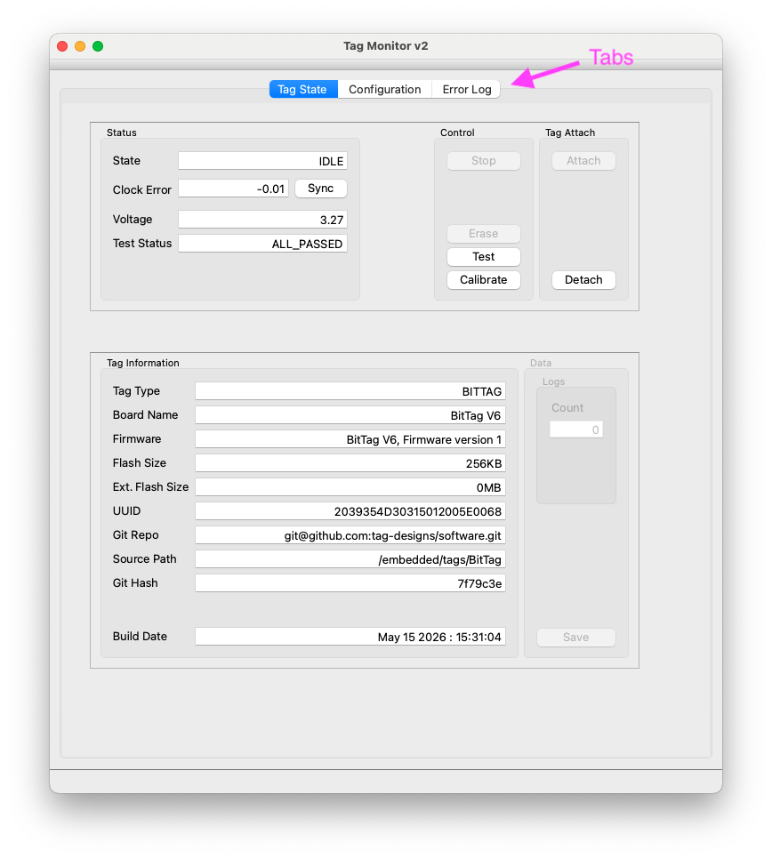
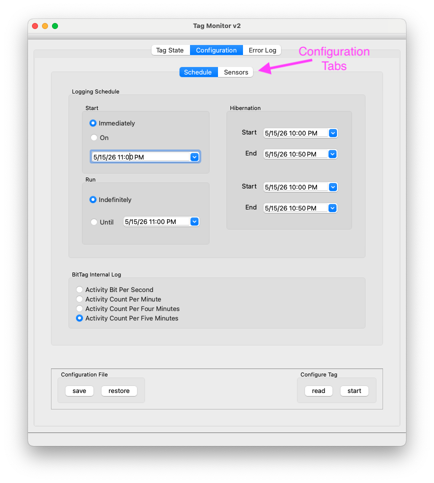
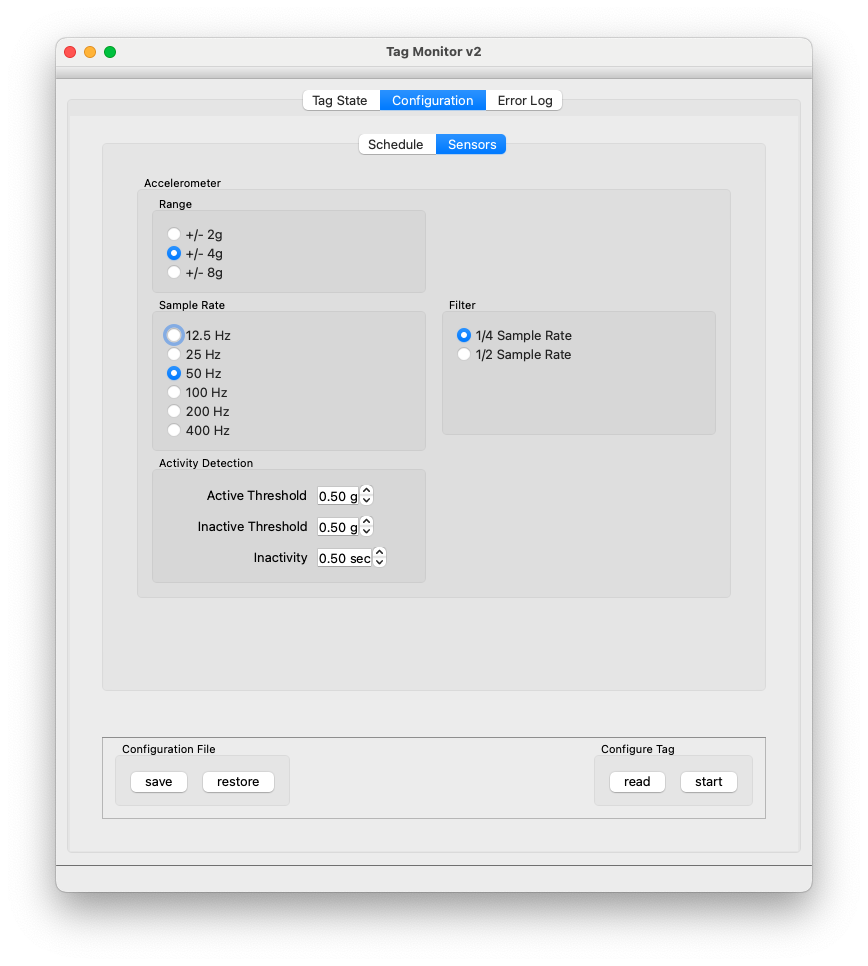

# Tag Monitor

Use Tag Monitor to connect to a tag or base station and inspect live messages.

## Connect to a Device

1. Connect a tag base with an installed tag to the computer via USB
2. Open the qtmonitor app

The tag monitor, illustrated in the following figure, has three tabs -- "Tag State", "Configure", and "Error Log"
 

The initial tab is "Tag State."  This tab has five regions -- "Status", "Control," "Tag Attach," "Tag Information," and "Tag Data" (grayed out in the
current state).  This tab, like the "Configure" tab, is modal -- only the currently relevant controls and state are active.  For example, there are greyed out controls on the 
Tag State tab to "Stop" (a running tag), to "Erase" (a stopped tag), and to "Save" the data from a stopped tag.

The "Status" region gives the current state of the tag ("IDLE"), the current error of the tag's internal clock (as a well as a control to synchronize the tag's clock to the host computer), the current Voltage of the tag battery (if any), and the current state of the tag's self-tests.  To the right of the test status is a test control to execute the tag's self-tests. 
*NOTE -- it is important to synchronize the tag's clock and successfully execute the self-tests before using the tag for a data logging experiment*

The "Tag Information" region gives various information about the tag and its programmed software.  The most important information consists of the tag type, its UUID (unique id), and its Git Hash.  The UUID is a unique identifier provided by the microprocessor manufacturer and the GIT Hash identifies the specific software version used to program the tag.  This information can be important to help resolve any issues that might arise.

The "Configure" tab, illustrated in the following figure  has two sub-tabs -- "Schedule" and "Sensors".
 

The function of the configuration tab is to define the tag configuration for a specific experiment.  *Note: configuration is written to the tag and the tag started when the "start" button i the lower right is pressed.  Until that action, the configuration can be regarded as planned.  It's possible to "save" the current configuration to a file, and "restore" a saved configuration from a file.  It's also possible to "read" the (default) configuration from the connected tag.

Unlike the "Tag State Tab", the contents of these sub-tabs vary by tag type.  For example, the BitTag
Schedule Tab has controls to define when data collection should begin and when it should end (both defined in UTC).  It also has two optional "hibernation" periods when the tag will enter a low-power state and stop collecting data.  Hibernation periods defined before the start time have no effect.   The BitTag configuration also provides a way to define the internal log format.  The log format determines the period over which activity data is "binned" -- seconds, minutes, four minutes, or five minutes.  The logging memory of a BitTag can collect five minute bins for more than a year (subject to battery capacity), but one second bins for only about 230 hours and one minute bins for about 2300 hours.

The contents of the "Sensor" tab are also dependent upon the tag type.
 

The BitTag has a single sensor -- the adxl362 accelerometer.  The sensor tag provides access to all of the configuration parameters for this sensor.  The most important parameters are for activity detection.  They define the acceleration thresholds (in units of g) for detecting the presence or absence of activity and the length of inactivity before the tag considers the most recent active period to have ended.  The other parameters define the acceleration sensitivity (the total range), the sample rate, and the intenal antialiasing filter bandwidth.  It is unlikely that most experimenter will need to vary these parameters.

The final "Error Log", not illustrated, provides an edit window to receive error messages and a way to save this error log to a file.  In the event of unexpected behavior, it is good to examine these messages for clues about the root cause.


## Common Checks

- Device identity and firmware version
- Sensor status
- Battery or power status
- Logging state
- Error messages

## Screenshot Placeholder

```md

```

