# Tag Monitor

Tag Monitor connects to a tag through a USB base and shows the information
needed to prepare, check, run, and recover a data logging experiment. Use it to
verify the tag identity and firmware, synchronize the tag clock, run self-tests,
edit the tag configuration, start logging, download finished data, and inspect
error messages.

## BitTag Walkthrough

The examples in this section use a classic BitTag so the main screens are
consistent. Other tag types use the same Tag State and Error Log screens; only
the Configuration tab changes by tag family.

### Opening Screen

When Tag Monitor opens with no tag attached, the Tag State tab is visible but
most tag-dependent fields and controls are inactive. Connect a base with an
installed tag, then press **Attach** if the application did not attach
automatically.

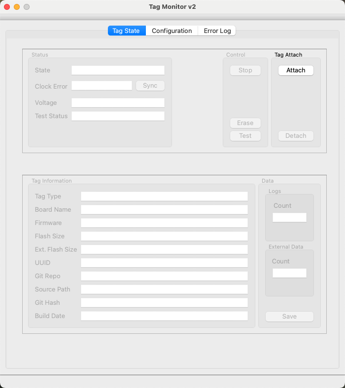

### Tag State

The Tag State tab has five main areas: Status, Control, Tag Attach, Tag
Information, and Data. The enabled controls depend on the current tag state.

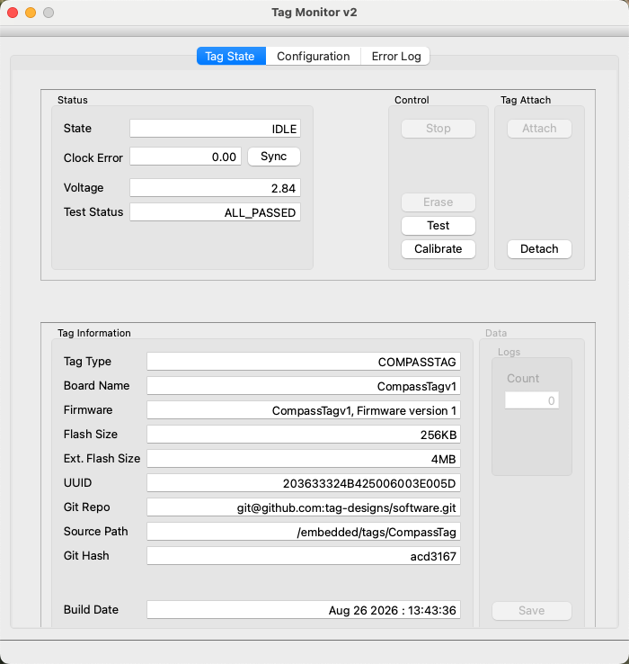

Check the state, voltage, self-test result, UUID, firmware version, and Git hash
before using a tag in the field. The UUID identifies the physical tag and the
Git hash identifies the firmware build loaded on it.

Synchronize the clock and run self-tests before starting an experiment. Tags
that support calibration, currently CompassTag and IMUTag, also show a
calibration control when attached.

When a tag is running, configuration controls are inactive and **Stop** is
available.

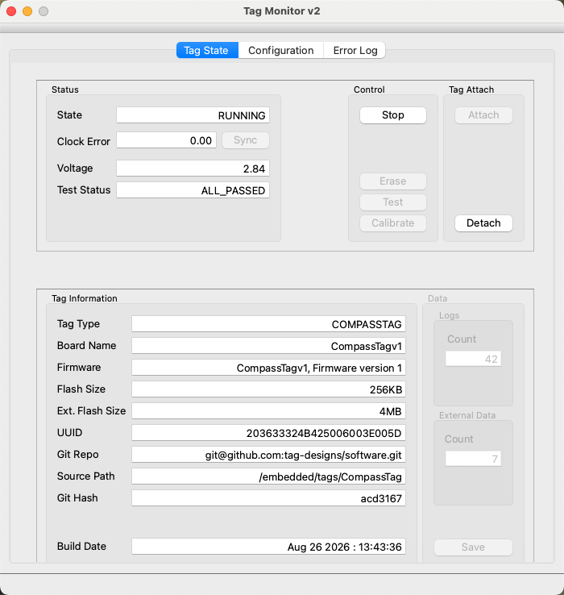

When a tag has finished logging, Tag Monitor enables the data controls used to
save tag data.

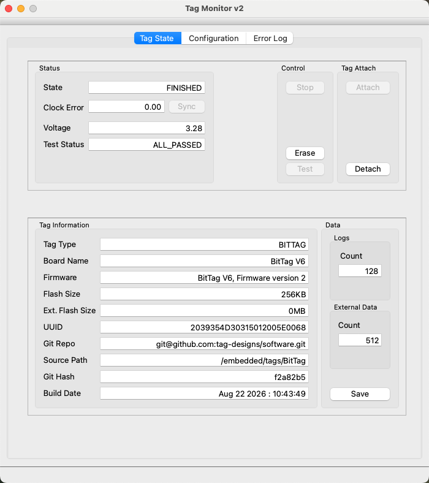

### Configuration

The Configuration tab defines the experiment plan that will be written to the
tag. The **Schedule** sub-tab controls when logging starts, when it ends, and
any hibernation periods. Some tag types also show a **Sensors** sub-tab with
tag-specific sensor controls.

Pressing **start** writes the displayed configuration to the tag and starts the
tag. Until then, the displayed configuration is only a planned configuration.
Use **save** and **restore** to move configurations through files, and **read**
to reload the current configuration from the attached tag.

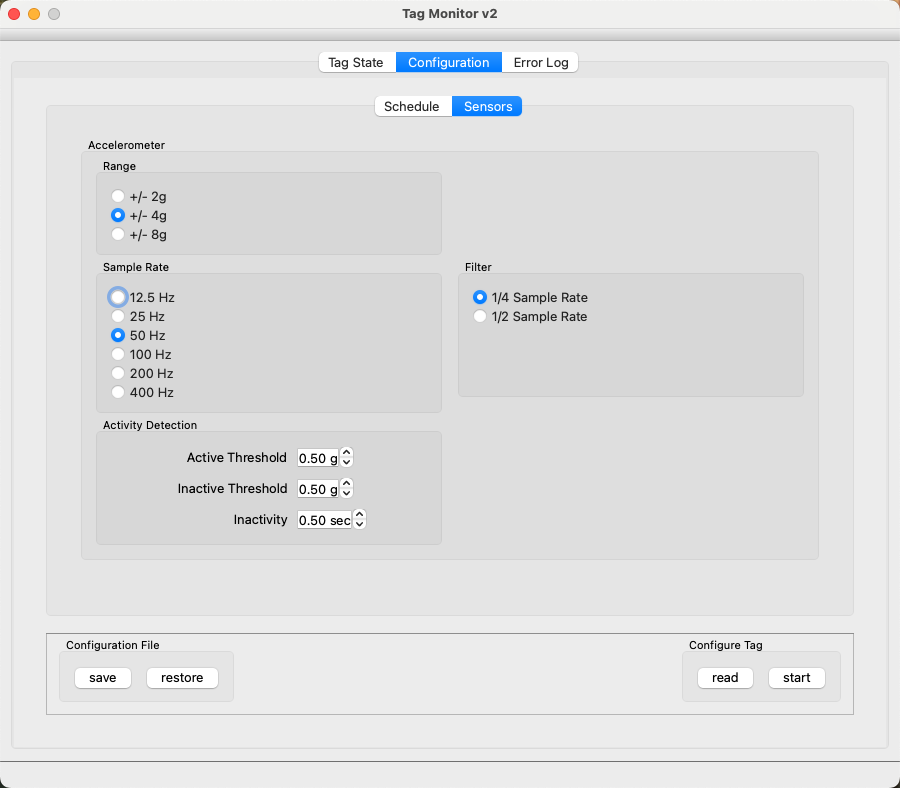

### Error Log

The Error Log tab collects application and tag communication messages. If Tag
Monitor behaves unexpectedly, check this tab first and save the log if the
message history will help diagnose the issue.

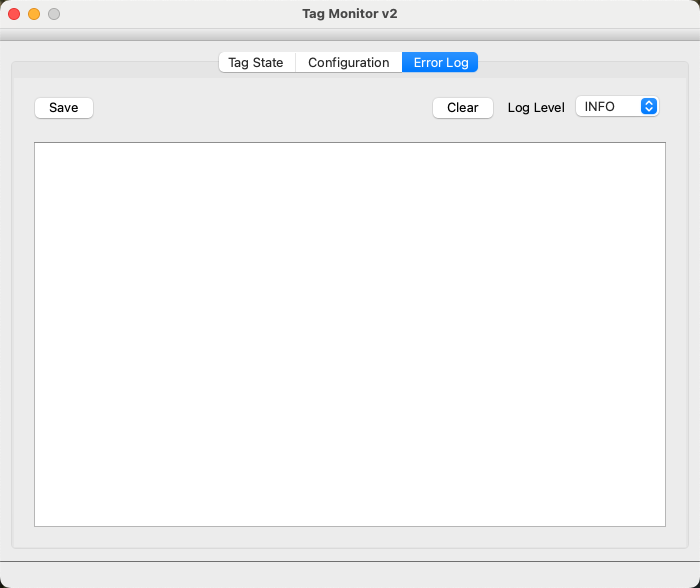

## Common Workflow

1. Connect the USB base with the tag installed.
2. Attach to the tag and verify tag type, UUID, firmware, Git hash, and voltage.
3. Synchronize the tag clock.
4. Run self-tests and resolve any reported problem.
5. Configure the schedule and any sensor settings for the experiment.
6. Press **start** to write the configuration and begin logging.
7. After logging finishes, save the tag data before erasing or redeploying.
8. Use the Error Log when attach, configuration, test, or download behavior is
   unexpected.

## Tag Configuration

The Configuration tab is intentionally tag-specific. Every tag has a schedule
view, but only tags with user-configurable sensor fields show a Sensors sub-tab.

### BitTag

Classic BitTag exposes the full ADXL362 accelerometer configuration. The
schedule controls define the active logging interval and optional hibernation
periods. The BitTag log format controls how activity is binned in memory:
shorter bins provide finer time resolution and consume storage faster.

The Sensors sub-tab configures ADXL362 range, sample rate, anti-alias filter,
and activity detection thresholds. Most experiments primarily tune the active
and inactive thresholds plus inactivity duration; range, rate, and filter are
usually changed only for specialized deployments.

### BitTag LE

BitTag LE uses the same schedule concepts as classic BitTag. Its low-energy
firmware fixes some accelerometer operating parameters, so the Sensors sub-tab
shows only the fields users are expected to tune.

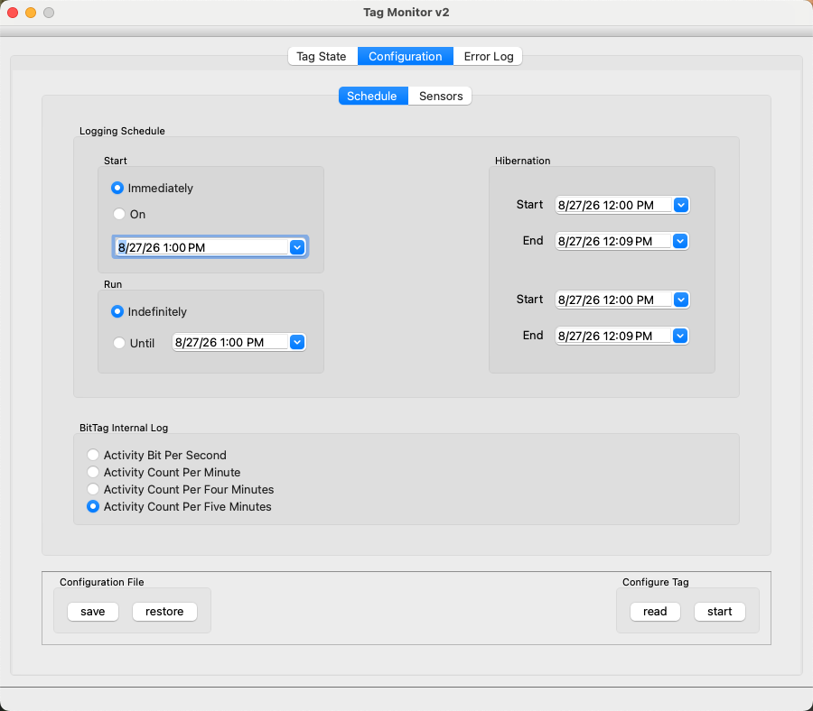

The BitTag LE sensor controls expose ADXL362 wake/activity thresholds and the
inactivity sample count. In this mode, inactivity is a count at the wake-mode
sample rate rather than a duration in seconds.

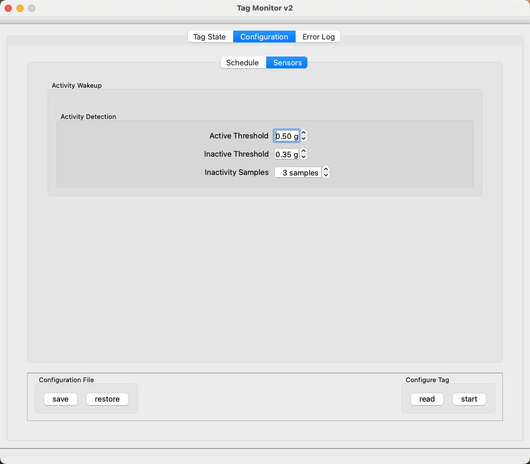

### BitPresTag

BitPresTag combines BitTag-style activity logging with pressure-tag behavior.
Use the schedule fields for the deployment interval and hibernation windows.

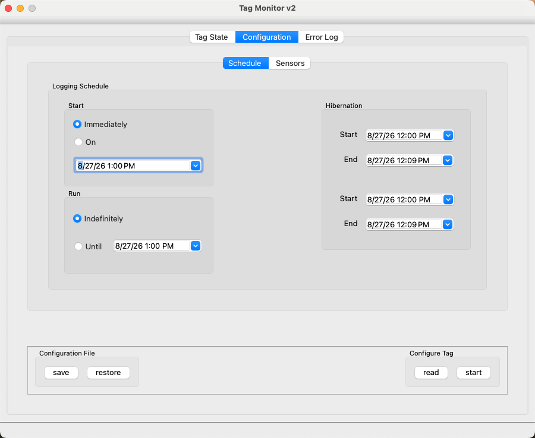

The Sensors sub-tab exposes the wake/activity fields that apply to the
BitPresTag firmware. As with BitTag LE, firmware fixes the hidden accelerometer
parameters.

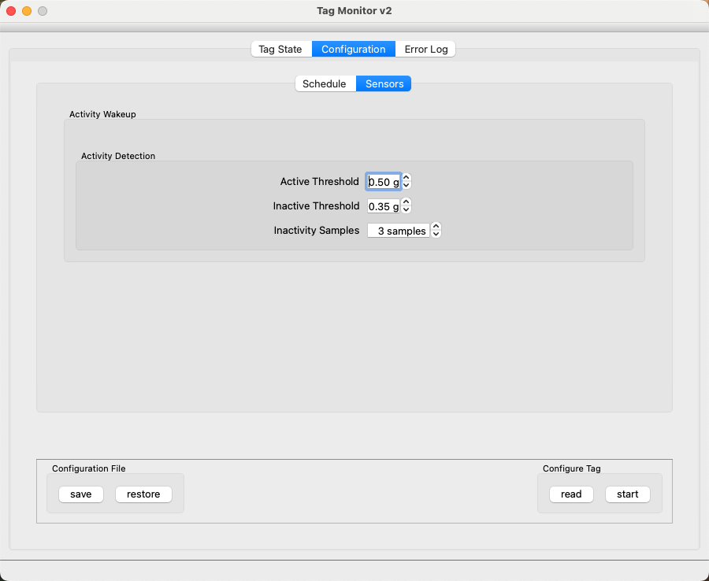

### PresTag

PresTag currently presents the schedule view without additional user-visible
sensor controls. If the Sensors sub-tab is absent, there is no separate sensor
configuration step for this tag type.

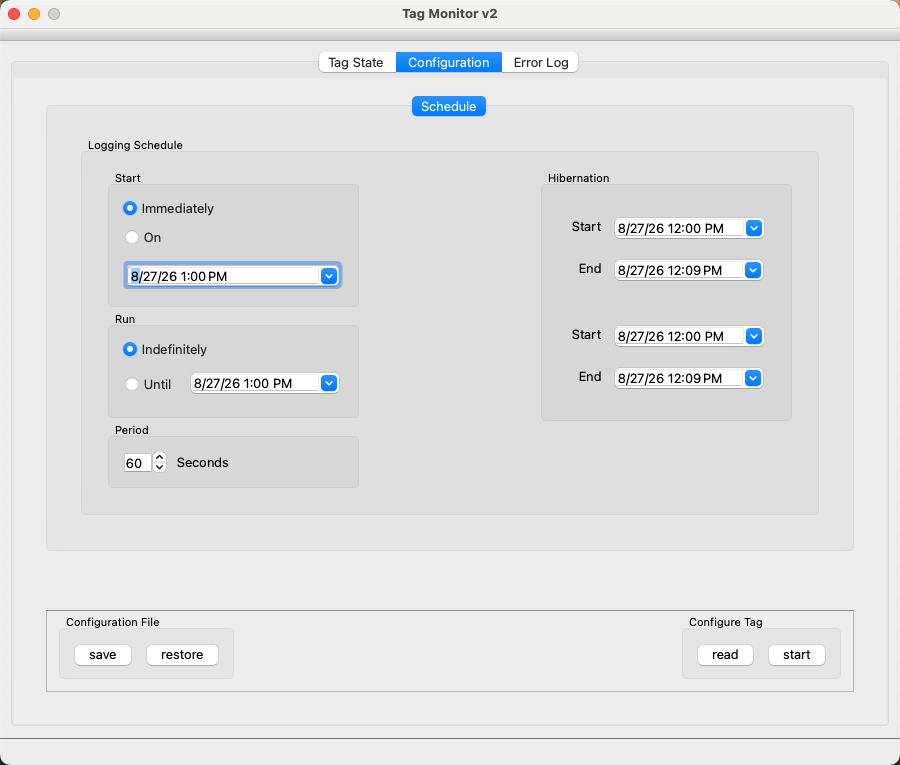

### IMUTag

IMUTag uses the schedule view for deployment timing and hibernation windows.
Because IMUTag supports calibration, the Tag State tab also exposes the
calibration control when an IMUTag is attached.

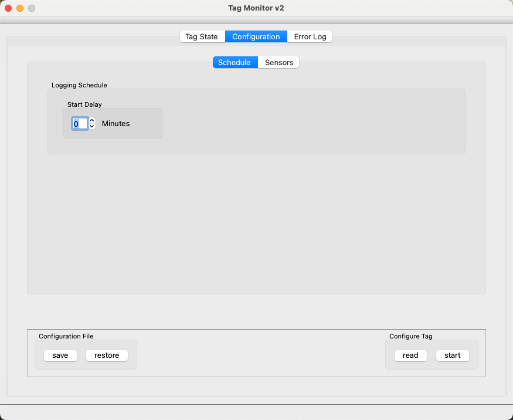

The Sensors sub-tab configures the IMU fields exposed by the firmware, including
sample rate and measurement ranges.

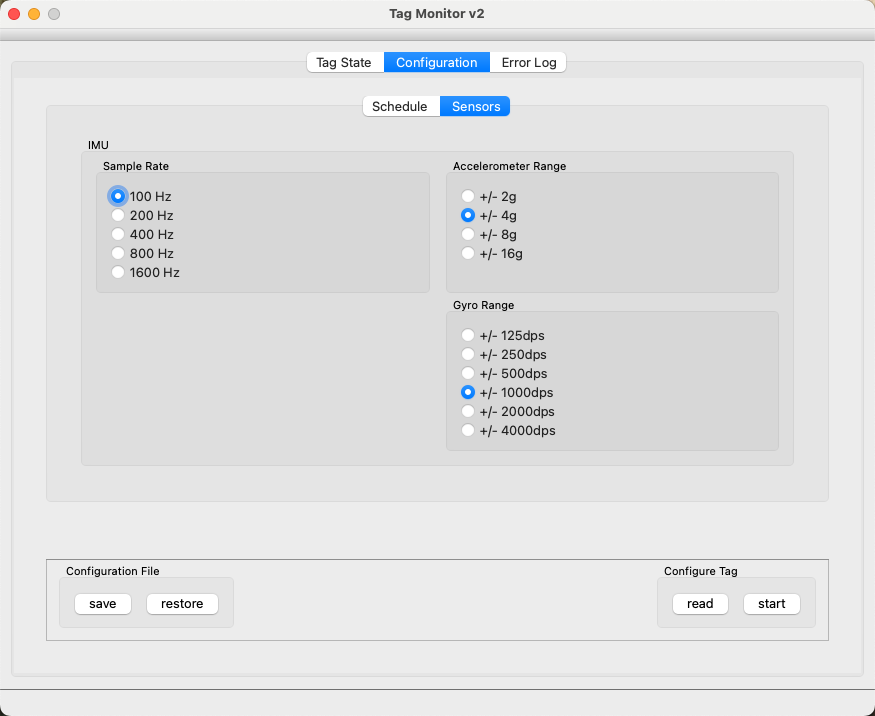

### CompassTag

CompassTag uses the schedule view for deployment timing. Like IMUTag, it
supports calibration from the Tag State tab. The current CompassTag fixture does
not expose separate user-visible sensor controls in Tag Monitor.

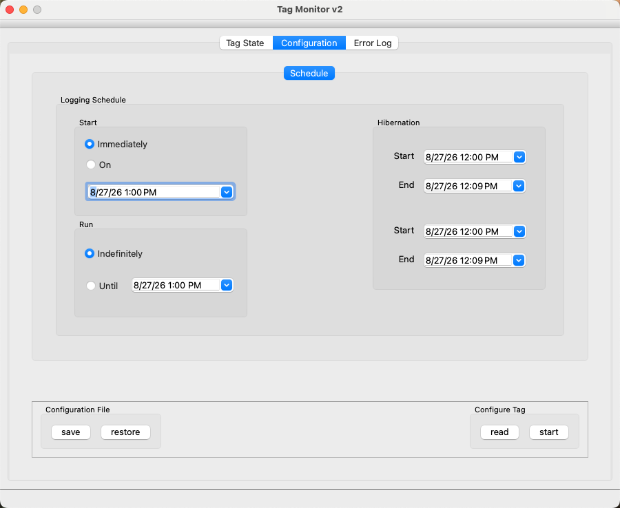
