# SensorViz

Use SensorViz to inspect SQLite sensor logs from pressure, activity, and
CompassTag logs. The application is intended for comparing raw sensor streams
and derived views, such as altitude computed from pressure, filtered activity,
and compass-derived heading/orientation streams.

At startup, only **File > Load** and **File > About** are useful. Most commands
become available after you load a SQLite log file. SensorViz enables additional
menu items when the loaded file contains the streams or metadata needed by those
features.

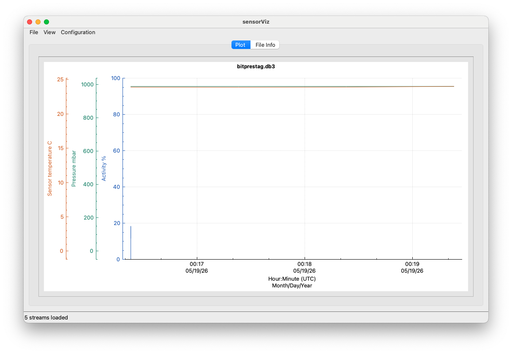

## Open a Data File

1. Open SensorViz.
2. Choose **File > Load**.
3. Select a downloaded SQLite log file with the `.db3` extension.
4. Review the loaded tag and file details in the **File Info** tab.
5. Return to the plot tab to inspect the available sensor streams.

The **File Info** tab lists the file name, tag type, profile name, loaded record
sets, compass calibration status when present, and other log metadata. Qt
diagnostic messages are also routed to this tab.

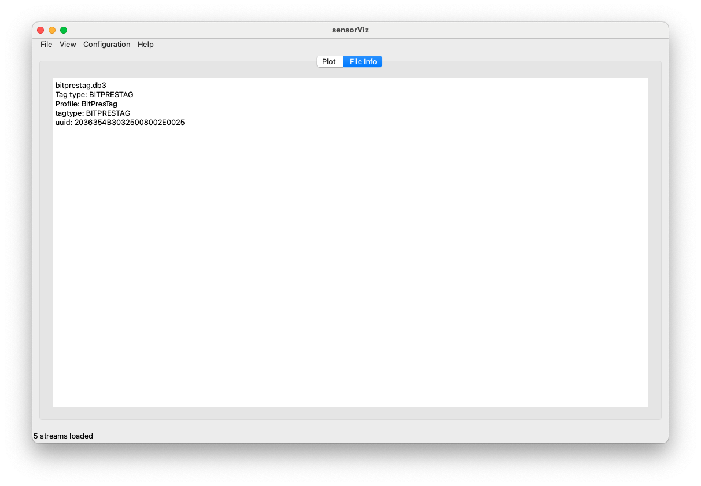

## File Menu

The **File** menu contains log-level actions, preference file commands, printing,
and application information.

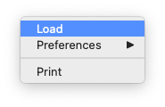

| Menu item | Function |
| --- | --- |
| **Load** | Opens a SensorViz SQLite log file. Loading a file replaces the current stream list, resets manual y-axis ranges, updates the File Info tab, and rebuilds the plot. |
| **Preferences** | Opens a submenu for loading, storing, or clearing SensorViz display preferences. |
| **Print** | Opens a print preview for the current plot. The preview can then be printed through the platform print dialog. |
| **About** | Shows SensorViz application information. |

## File > Preferences Submenu

The **Preferences** submenu stores display choices by tag type. It is enabled
after a log is loaded.

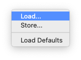

| Menu item | Function |
| --- | --- |
| **Load...** | Loads a SensorViz preferences JSON file and applies the matching tag-type entry to the current log. |
| **Store...** | Writes the current preference overrides to formatted JSON. SensorViz stores only differences from built-in defaults. |
| **Load Defaults** | Removes overrides for the currently loaded tag type and reapplies built-in SensorViz defaults. |

Preference files may include visible stream selections, stream colors, and axis
side choices. They do not store y-axis ranges, sea-level pressure, declination,
UTC offset, or battery direction because those are analysis/session settings.

## View Menu

The **View** menu controls what appears on the plot and how visible streams are
drawn.

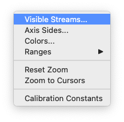

| Menu item | Function |
| --- | --- |
| **Visible Streams...** | Opens a checklist of loaded raw and generated streams. Use it to show or hide streams without reloading the log. |
| **Axis Sides...** | Opens a dialog that assigns each visible stream to the left or right side of the plot. This is useful when streams have different units or overlapping ranges. |
| **Colors...** | Opens a dialog for changing the display color of each visible stream. Each stream can be reset to its default color. |
| **Ranges** | Opens a submenu with one range command for each visible stream. |
| **Reset Zoom** | Restores the full loaded time span and clears manual y-axis ranges. Fixed metadata ranges and data-derived default ranges are reapplied. |
| **Zoom to Cursors** | Zooms the time axis to the interval between the two vertical cursors. |
| **Calibration Constants** | Shows read-only CompassTag calibration constants when the loaded log includes compass calibration metadata. |

Default stream visibility depends on the stream id. Activity, pressure, and
pressure-sensor temperature default to visible. Core temperature, voltage, and
altitude default to hidden. CompassTag heading and acceleration default to
visible; pitch, roll, dip, and magnetic field default to hidden.

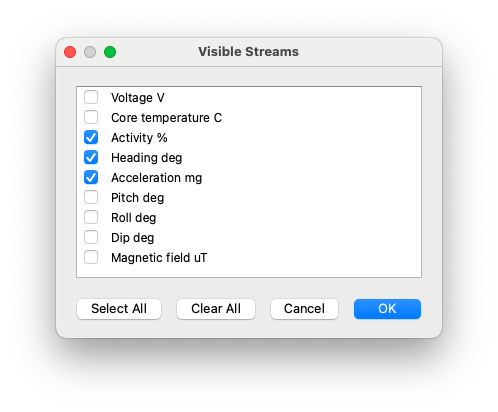

## View > Ranges Submenu

The **Ranges** submenu is rebuilt from the streams currently visible on the
plot. Each item is named for one stream, for example **Pressure Range...** or
**Altitude Range...**.

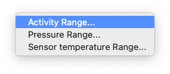

| Menu item | Function |
| --- | --- |
| **_Stream_ Range...** | Opens a dialog for the selected stream with minimum and maximum y-axis values. The dialog uses the stream units when units are available. |

Range defaults are chosen in this order:

1. A manual range set by the user.
2. A fixed display range from SensorViz metadata, such as activity `0-100`,
   voltage `0-5 V`, or core temperature `0-50 C`.
3. The loaded data minimum and maximum with padding.

Pressure and altitude are linked until altitude receives its own explicit
range. If you set a pressure range while altitude is visible, SensorViz derives
a matching altitude range. Activity and the low-pass activity filter are also
kept on the same range until one of them is adjusted independently.

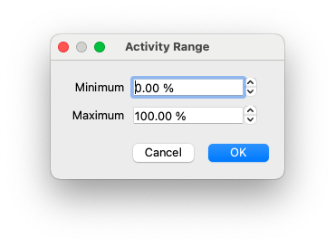

## Configuration Menu

The **Configuration** menu controls plot presentation and derived-view
parameters.

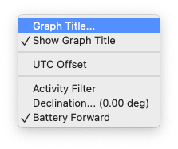

| Menu item | Function |
| --- | --- |
| **Graph Title...** | Opens a dialog to edit the title displayed above the plot. New files default to showing the loaded file name as the title. |
| **Show Graph Title** | Shows or hides the current graph title. |
| **UTC Offset** | Sets the UTC offset used for time-axis labels. The stored sample times remain UTC epoch seconds. |
| **Sea-level Pressure...** | Sets the mean sea-level pressure used to calculate altitude from pressure. This item appears when the loaded log has a pressure stream. |
| **Activity Filter** | Shows or hides a low-pass filtered activity stream. When enabled, SensorViz asks for the filter time constant in seconds. This item appears when the loaded log has activity data. |
| **Declination...** | Sets magnetic declination in degrees for true-heading display. This item appears when CompassTag raw samples and calibration constants are loaded. |
| **Battery Forward** | Toggles the CompassTag heading convention. When unchecked, heading is rotated by 180 degrees to match the opposite physical orientation. This item appears for CompassTag logs with calibration data. |

Sea-level pressure and declination values are shown in the menu text after they
are available, so the active parameter is visible without reopening the dialog.
The plot also annotates altitude with the current sea-level pressure and heading
with the current declination.

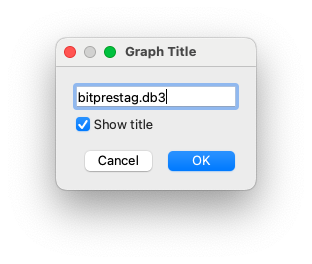

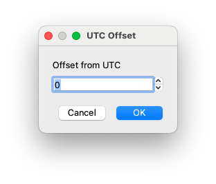

## Derived Views

SensorViz creates some streams from loaded data so they can be inspected beside
raw streams.

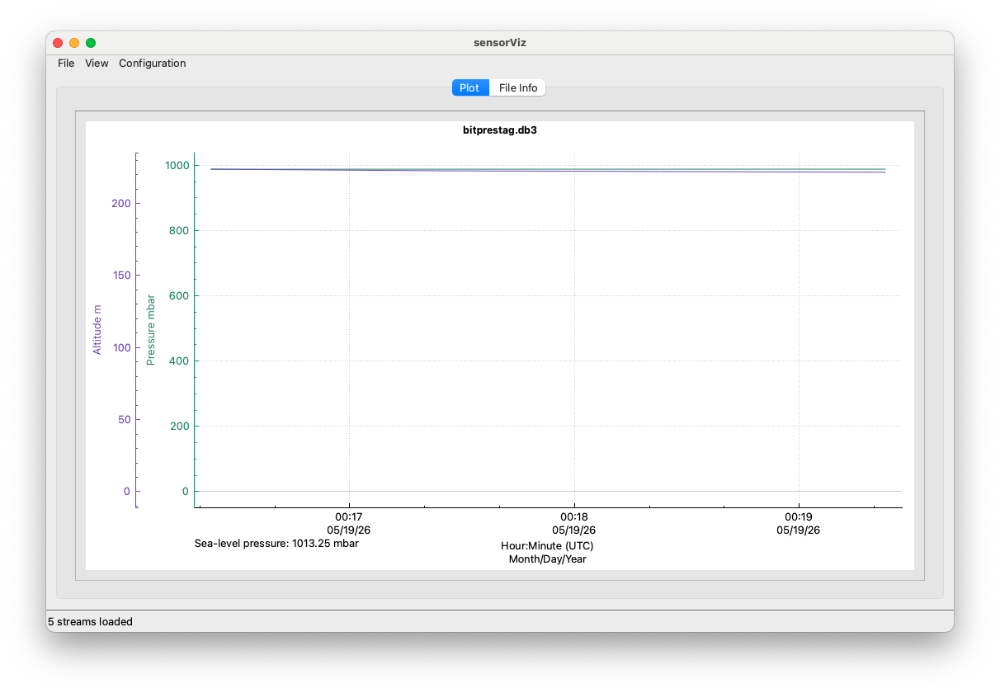

| Derived view | How to control it |
| --- | --- |
| **Altitude** | Generated automatically when pressure is present. Show or hide it from **View > Visible Streams...** and adjust its calculation with **Configuration > Sea-level Pressure...**. |
| **Activity filter** | Enable or disable it with **Configuration > Activity Filter**. The filter is display-only and does not alter the raw activity stream. |
| **CompassTag heading and orientation streams** | Generated automatically when the log contains raw compass samples and calibration constants. Show or hide individual compass streams from **View > Visible Streams...**. Adjust heading display with **Configuration > Declination...** and **Configuration > Battery Forward**. |

CompassTag logs may also show a compass/orientation panel beside the plot. Moving
the mouse over the plot updates that panel to the nearest loaded compass sample.

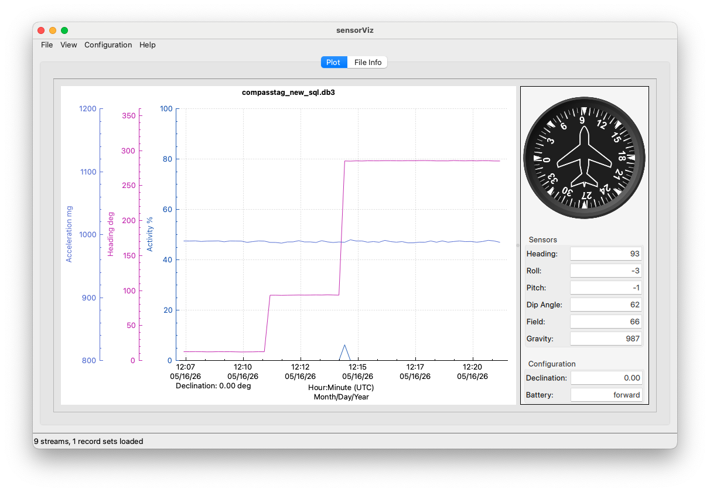

## Plot Context Menu

Right-click the plot to open a context menu that mirrors the top-level **File**,
**View**, and **Configuration** menus. The context menu is useful when working
directly inside the plot because it exposes loading, preferences, stream
visibility, ranges, zoom commands, printing, and derived-view settings without
moving to the menu bar.

The context menu only shows data-dependent items that make sense for the current
file. For example, **View > Ranges** is populated from visible streams, and
CompassTag configuration items appear only when the required compass data and
calibration constants are present.

## Cursor And Zoom Controls

SensorViz uses two vertical cursors for selecting a time interval. Double-click
the plot to move the left cursor. Shift-double-click to move the right cursor.
Choose **View > Zoom to Cursors** to zoom the x-axis to the selected interval.
Choose **View > Reset Zoom** to return to the full loaded time range.

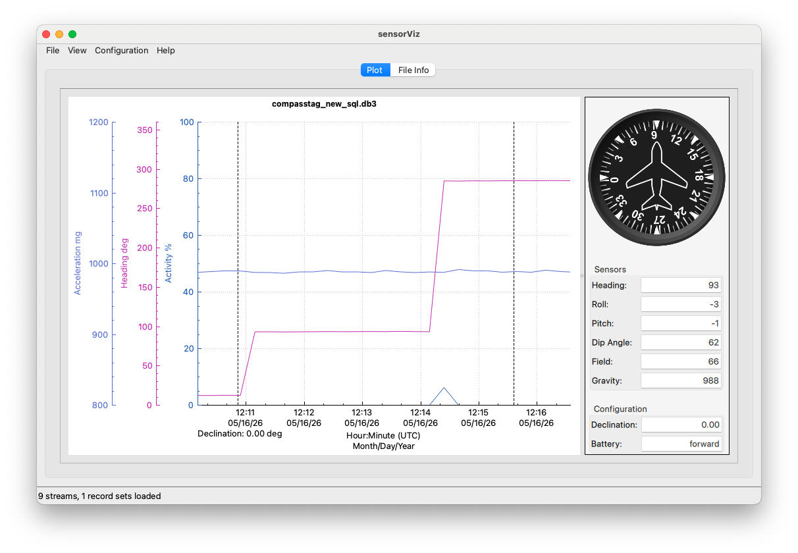

The mouse tooltip reports the time at the pointer and nearby stream values. For
CompassTag logs, moving over the plot also updates the orientation panel.

## Print Preview

Choose **File > Print** to open a print preview of the current plot. SensorViz
renders the plot in landscape orientation and preserves the on-screen aspect
ratio for printing.

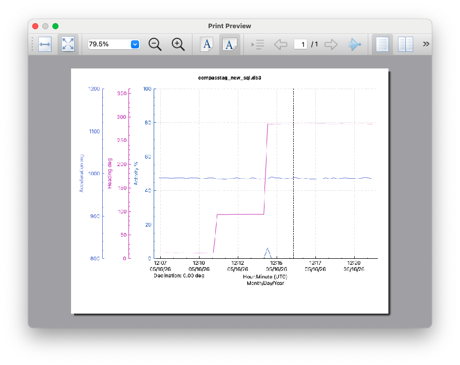

## Troubleshooting

| Symptom | What to check |
| --- | --- |
| A file does not load | Confirm that the file is a SQLite log with the expected `.db3` format. SensorViz reports loader errors in a modal message. |
| A file loads but no expected stream appears | Check whether the log contains stream metadata for that sensor table. SensorViz builds the stream list from the SQLite `streams` metadata. |
| A menu item is disabled or hidden | Load a log first, then confirm that the file contains the stream or metadata required by that command. Pressure controls require pressure data, activity filter requires activity data, and CompassTag controls require raw compass samples plus calibration constants. |
| A custom color, visibility, or axis side does not reappear | Load the matching preferences JSON file with **File > Preferences > Load...**. Preferences are keyed by tag type or profile name. |
| The y-axis range looks wrong | Use **View > Ranges** to set an explicit range, or use **View > Reset Zoom** to clear manual ranges and return to defaults. |
