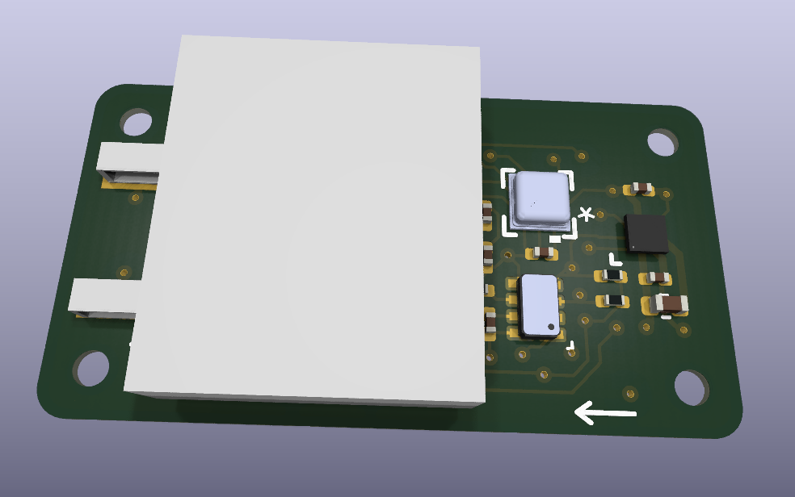
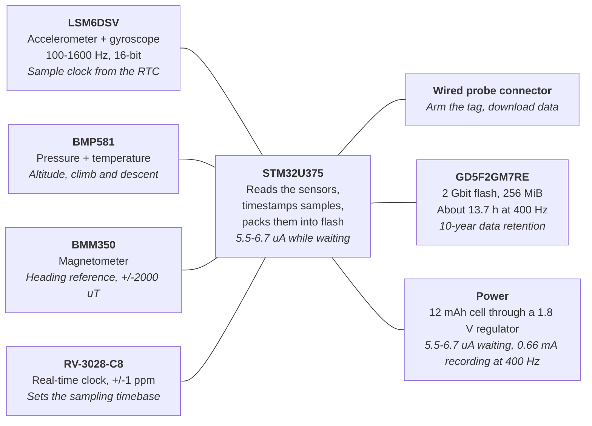
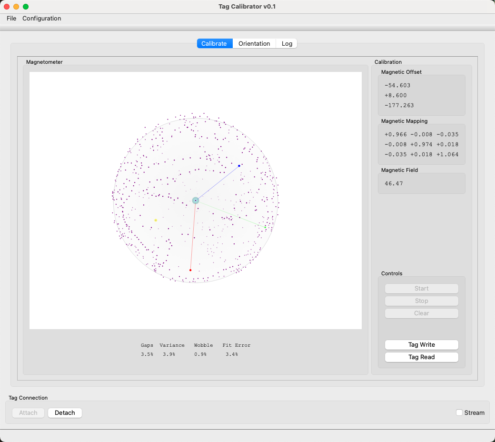

# The IMUTag: An Overview

An introduction for people who will deploy IMUTags and analyze the data they
produce. Covers what the tag is, what it records and how well, how you use it,
and what it cannot yet do.

Status: 2026-10-04. Every figure here comes from breakout hardware; the
integrated `imutag-smps` board has not yet been fabricated.

---

## 1. Overview

The IMUTag is an ultralight archival datalogger for recording how a bird moves.
It writes acceleration, rotation rate, magnetic field, barometric pressure and
temperature to on-board flash memory, and you read the data out after
recovering the tag.

It has no radio and no position fix. Nothing is transmitted in the field, so
the tag must be recaptured to get the data. In exchange it is small, it draws
almost nothing while waiting, and it samples fast enough to resolve individual
wingbeats.



The white block is the battery, which sits over most of the board and covers
the majority of the top-side components.

### At a glance

| | |
| --- | --- |
| Sample rates | 100, 200, 400, 800 or 1600 Hz, chosen before deployment |
| Channels | 3-axis acceleration, 3-axis rotation, 3-axis magnetic field, pressure, temperature |
| Storage | 2 Gbit (256 MiB) flash on the tag -- no radio, no live link |
| Typical deployment | 13.7 hours of continuous recording at 400 Hz on a 12 mAh cell |
| Waiting, armed | 5.5-6.7 uA -- 74 to 91 days on a 12 mAh cell, so the tag can sit for months before a recording window opens |
| Clock | +/-1 ppm, about 4 ms of drift per hour |
| Getting data out | A SQLite file, over a wired probe, after recovery |

### What it measures

| Channel | Recorded at | What it is useful for |
| --- | --- | --- |
| Acceleration, 3 axes | the full configured rate | Wingbeats, takeoff and landing, body posture, activity budgets |
| Rotation rate, 3 axes | the full configured rate | Turns, rolls, and changes in body attitude |
| Magnetic field, 3 axes | one tenth of the configured rate | Heading reference; combined with the other two, orientation |
| Barometric pressure | one tenth of the configured rate | Altitude, and climb and descent rate |
| Temperature | once per stored page | Ambient temperature at the sensor |

The accelerometer and gyroscope run at whatever rate you choose. The
magnetometer and pressure sensor are recorded ten times less often, which is a
deliberate trade: they cost current and they change more slowly than a wingbeat
does.

### How you use one

1. **Connect.** The tag attaches through a small wired probe. Its clock is
   synchronized to the computer's.
2. **Configure and arm.** You choose the sample rate and the measurement
   ranges, then start collection.
3. **Deploy.** The tag records until it is stopped, the battery runs down, or
   the flash fills.
4. **Recover and download.** Attach it again and download to a single SQLite
   file.
5. **Look at the data.** `sensorviz` plots everything in that file; the file is
   also directly readable from Python, R or MATLAB.

### Current status

The firmware runs on breakout hardware: the tag's processor, sensors and flash
on a daughter card, powered through a separate breakout carrying the same
TPS62840 regulator the final board uses. On that hardware it has been through
release checks and a full sweep of every sample rate, each with a verified
download, and those measurements are the figures in this overview. The
integrated `imutag-smps` board has passed design checks but **has not yet been
fabricated**, so no figure here comes from it.

---

## 2. Hardware

The tag is one microcontroller, four sensor devices, a flash chip and a
precision clock, all running from a single 1.8 V rail. You do not need the
wiring detail to use it, but two things about the arrangement do affect your
data.



First, all of the timing is derived from the real-time clock (RTC) chip, which
provides a 32.768 kHz timing signal; the RTC carries stored correction
parameters that bring it to +/-1 ppm at 25 C. Second, there is one wired
connector and it does everything: arming, self-test and download.

### What is fitted

| Part | Role | Size and capacity | Datasheet |
| --- | --- | --- | --- |
| LSM6DSV | Accelerometer and gyroscope | LGA-14L 2.5x3.0 mm; 16-bit output; ranges selected per deployment | [lsm6dsv.pdf](https://github.com/tag-designs/hardware/blob/main/BoardDesigns/libraries/datasheets/lsm6dsv.pdf) |
| BMM350 | Magnetometer, heading reference | WLCSP 1.28x1.28 mm; +/-2000 uT on all three axes | [bst-bmm350-ds001.pdf](https://github.com/tag-designs/hardware/blob/main/BoardDesigns/libraries/datasheets/bst-bmm350-ds001.pdf) |
| BMP581 | Pressure and temperature, altitude | LGA 2.0x2.0 mm; 300-1250 hPa | [bst-bmp581-ds004.pdf](https://github.com/tag-designs/hardware/blob/main/BoardDesigns/libraries/datasheets/bst-bmp581-ds004.pdf) |
| GD5F2GM7RE | Stores the recording | WSON-8 8x6 mm; 2 Gbit (256 MiB); 10-year data retention | [datasheet](https://github.com/tag-designs/hardware/blob/main/BoardDesigns/libraries/datasheets/DS_00819_GD5F2GM7RE_Rev1_3-3435814.pdf) |
| RV-3028-C8 | Keeps time and paces the sampling | SON-8 2.0x1.2 mm; +/-1 ppm factory-trimmed; 70 nA | [RV-3028-C8.pdf](https://github.com/tag-designs/hardware/blob/main/BoardDesigns/libraries/datasheets/RV-3028-C8.pdf) |
| STM32U375 | Reads the sensors and writes the flash | UFQFPN32 5x5 mm; 1 MB program memory, 256 KB RAM | [stm32u375ce.pdf](https://github.com/tag-designs/hardware/blob/main/BoardDesigns/libraries/datasheets/stm32u375ce.pdf) |
| TPS62840 | Makes the 1.8 V rail everything runs from | WCSP-6 0.97x1.47 mm; 60 nA quiescent | [tps62840.pdf](https://github.com/tag-designs/hardware/blob/main/BoardDesigns/libraries/datasheets/tps62840.pdf) |

What each sensor resolves, and how noisy it is, is in section 3 rather than
here.

The IMU is a plain **LSM6DSV**, confirmed against the schematic and the
production BOM (LCSC C5267399). The firmware module that drives it is named
`sensor_imu_lsm6dsv16x` for historical reasons; the part fitted is the LSM6DSV
and the figures in section 3.2 are its.

### What the hardware means for your data

These are the limits worth knowing before you plan a study.

- **You must recover the tag.** There is no radio and no position fix of any
  kind. A tag that is not recaptured yields nothing.
- **Recording time is bounded, and by different things at different rates.**
  Below 400 Hz the battery gives out first; at 400 Hz and above the flash fills
  first. Section 3.5 works this through.
- **The magnetometer and pressure sensor are sampled ten times less often than
  the motion sensors.** For heading and altitude this is ample. It does mean
  the three sensor families do not share sample times, which matters when you
  combine them.
- **In flight, the accelerometer does not measure gravity.** It measures
  specific force. During flapping, gravity is a small part of what the
  accelerometer sees, so the usual trick of using it to find "down" does not
  work well in the interesting parts of the record.
- **Pressure is excellent in relative terms and modest in absolute terms.**
  Changes of a few pascals -- centimetres of altitude -- are resolvable;
  absolute altitude carries a +/-30 Pa offset and a few metres of uncertainty
  from weather.
- **Clock accuracy degrades away from room temperature.** The +/-1 ppm figure
  holds near 25 C, and the crystal slows as roughly 0.035 ppm per degree
  squared either side of it. This is not currently corrected for, though the
  tag does record the temperature needed to do so.

---

## 3. What the Tag Records

You configure one thing -- the sample rate -- and everything else follows from
it. Higher rates resolve finer movement, produce proportionally more data, and
shorten the deployment.

### 3.1 Sample rates

| Sample rate | Magnetic, pressure, temperature | Data produced | Flash full after | Battery, 12 mAh | Runs out first |
| ---: | ---: | ---: | ---: | ---: | --- |
| 100 Hz | 10 Hz | 1.37 kB/s | 54.6 h | 22.3 h | battery |
| 200 Hz | 20 Hz | 2.73 kB/s | 27.3 h | 20.7 h | battery |
| 400 Hz | 40 Hz | 5.46 kB/s | 13.7 h | 18.1 h | flash |
| 800 Hz | 80 Hz | 10.9 kB/s | 6.83 h | 14.5 h | flash |
| 1600 Hz | 160 Hz | 21.8 kB/s | 3.41 h | 12.0 h | flash |

Acceleration and rotation are always recorded at the rate you select.
Whichever of the last two columns is smaller is what you actually get. Battery
figures are measured; section 3.5 has the currents behind them.

For scale: a small songbird's wingbeat is roughly 10-30 Hz, so 400 Hz gives on
the order of 15-40 samples per wingbeat.

One consequence of the ten-to-one ratio is worth planning around. The magnetic,
pressure and temperature channels do not share sample times with the motion
channels, and occasionally a slow-channel reading is missing altogether -- it
is recorded as a gap rather than as a repeat of the previous value. That is the
honest representation, but analysis code has to expect gaps rather than a
dense, aligned matrix.

### 3.2 Resolution, accuracy and noise

This is the table to work from when deciding whether a feature in your data is
real. Resolution depends on the measurement range you select; the noise column
is what actually limits you.

| Channel | Units in the file | Resolution | Range | Noise and accuracy |
| --- | --- | --- | --- | --- |
| Acceleration | mg | 0.061 / 0.122 / 0.244 / 0.488 mg per count at +/-2 / 4 / 8 / 16 g | +/-2 g to +/-16 g, selectable | 60 ug/sqrt(Hz) noise density; offset +/-12 mg typical |
| Rotation rate | degrees per second | 4.375 / 8.75 / 17.5 / 35 / 70 / 140 mdps per count | +/-125 to +/-4000 dps, selectable | 2.8 mdps/sqrt(Hz) noise density; offset +/-1 dps typical |
| Magnetic field | uT | about 0.1 uT | +/-2000 uT on all three axes | 190 nT rms (x, y), 450 nT rms (z); +/-25 uT offset before calibration, +/-2 uT after |
| Pressure | mbar | 0.016 Pa | 300-1250 hPa | 0.08-0.8 Pa rms; +/-6 Pa relative, +/-30 Pa absolute; drifts +/-10 Pa per year |
| Temperature | C | 0.01 C | -40 to +85 C | +/-0.5 C |
| Time | seconds since epoch, ~1 ms steps | ~0.98 ms | -- | +/-1 ppm near 25 C -- about 4 ms drift per hour |

### 3.3 Reading those numbers

**Noise, not resolution, is your floor.** Noise density times the square root
of your bandwidth gives the broadband noise you will actually see. At 400 Hz
the accelerometer contributes about 1.2 mg rms -- roughly ten times the
0.122 mg step size at +/-4 g. The gyroscope behaves the same way. The practical
consequence is that **choosing a wider measurement range costs you almost
nothing in precision**, so pick the range by what will clip, not by what will
resolve. If in doubt, go wider: a clipped wingbeat peak is unrecoverable,
whereas the extra quantization noise is invisible under the sensor's own noise.

**Pressure is the precise channel.** At the oversampling used, the sensor
resolves single pascals -- about 8 cm of altitude. Relative altitude over
seconds to minutes is genuinely good. Absolute altitude is not: the +/-30 Pa
absolute accuracy is a few metres, and weather moves sea-level pressure far
more than that over a day.

**Magnetometer data needs calibration to be useful.** Uncalibrated, the
zero-field offset is +/-25 uT against an Earth field of roughly 50 uT. After
the calibration procedure it falls to about +/-2 uT. Calibration constants are
stored on the tag and copied into every download, and the viewer applies them
automatically.

### 3.4 How samples are timed

Every sample carries a time, and those times are more trustworthy than they
would be on most loggers, because the sampling is paced by the +/-1 ppm
real-time clock rather than by the motion sensor's own oscillator.

Times are reconstructed by counting samples from the start of a recording
segment and scaling by the clock's measured error, which is stored in the file.
Individual page timestamps are deliberately *not* used to re-anchor each page
-- doing so would add millisecond-level jitter to an otherwise perfectly even
series. The result is a smooth, evenly spaced time axis within a segment.

A new segment starts whenever the recording is interrupted -- a restart, or a
gap where storage was skipped. These boundaries are marked in the file and
drawn in the viewer. Treat them as real discontinuities: do not integrate or
filter across one.

### 3.5 How long a deployment lasts

Two things end a recording: the battery runs down, or the flash fills. Which
one bites first depends on the rate you chose. The currents were measured on
the SMPS breakout carrying the IMUTagNandBmp581 daughter card at **3.6931 V**,
the voltage of a nominal 3.7 V cell, 120 s per point with a verified download at
every rate. Recording draws 539 uA at 100 Hz, 662 uA at 400 Hz and 1003 uA at
1600 Hz; those currents give the battery column of the table in section 3.1.
The per-rate measurements are in
[IMUTag power](https://tag-designs.github.io/software/developer/reference/embedded/tags/families/IMUTag/design/power.html).


Idle has measured as two distinct populations on the same board and image,
5.52 uA and 6.71 uA, and which one you get is not yet understood. **Plan on
74 days**, the pessimistic figure. The recording currents are reproducible to
better than 1%.

Below 400 Hz the battery gives out while there is still flash to spare, so a
larger cell buys recording time. At 400 Hz and above the flash fills first, and
a larger cell buys nothing -- only a lower rate would help. Waiting costs
almost nothing either way: at a few microamps a tag can sit armed for months
before a recording window opens, so it is the recording itself that is bounded,
not the deployment.

---

## 4. Using the Tag

Three desktop tools cover the whole cycle. All of them talk to the tag through
the same small wired probe.

### 4.1 Configuring and arming: qtmonitor

`qtmonitor` is where you inspect a tag and set it up. It has three tabs.
**Tag State** shows live status -- what the tag is doing, its battery voltage,
clock error, how much data it holds, and its identity and firmware version.
**Configuration** is where you set up a recording. **Error Log** collects
messages if something goes wrong.

Four settings matter for an IMUTag:

| Setting | Choices | What it affects |
| --- | --- | --- |
| Start delay | seconds between arming and the first sample | Lets you fit the tag before recording starts |
| Sample rate | 100, 200, 400, 800, 1600 Hz | Resolution, data volume, deployment length |
| Accelerometer range | +/-2, +/-4, +/-8, +/-16 g | What will clip. Pick by peak, not by precision |
| Gyroscope range | +/-125 to +/-4000 dps | Same |

Before arming, synchronize the clock -- this is what makes timestamps
comparable to anything else you record. The same tab has a self-test that
checks every sensor and the flash, and it is worth running before a deployment.

Magnetometer calibration is a separate step, covered next.

### 4.2 Calibrating the magnetometer: qtcalibrate

The magnetometer is the one channel that needs a per-tag calibration step, for
the reason given in section 3.3 -- uncalibrated, its offset is half the size of
the field it is trying to measure. `qtcalibrate` is the tool that fixes it, and
it is a once-per-tag job, not a once-per-deployment one.

Attach the tag, press **Start**, and turn it through as many orientations as
you can manage while samples accumulate. The plot shows where those samples
fall on a sphere; what you are aiming for is even coverage, because the fit is
only as good as the directions you actually visited.



Four numbers under the plot tell you whether you turned the tag enough.
**Gaps** is how much of the sphere you missed, **Variance** and **Wobble**
describe how tightly the samples sit on it, and **Fit Error** is how well the
fitted model matches them. Lower is better on all four; if Gaps stays high,
keep turning.

The fit produces a magnetic offset, a 3x3 mapping matrix and the field strength
those imply. **Tag Write** stores them on the tag and **Tag Read** shows what is
already there. Once written, the constants are copied into every download from
that tag, and `sensorviz` applies them without being asked.

The **Orientation** tab then shows live compass heading and attitude, which is
the quickest way to confirm the calibration behaves before you commit a tag to
a deployment.

Step-by-step instructions and the other collection milestones are in the
application guide, `host/docs/src/apps/qtcalibrate.md`.

### 4.3 Downloading


Either press the save button in `qtmonitor`, or use the command-line tool:

```
tag-dwnld -o flight042.db3
```

Both produce the same SQLite file. `-s` will stop a tag that is still recording
before downloading it. A download runs from start to finish and cannot be
resumed part-way, so let it finish; at full flash it moves a few hundred
megabytes over the probe and takes a while.

You can download a tag as many times as you like. The data stays on the tag
until you explicitly erase it, which is worth doing only once you have the file
safely copied.

### 4.4 Looking at the data: sensorviz

`sensorviz` opens a downloaded file and plots everything in it. It works out
what the file contains from the file itself, so there is nothing to configure
per tag type.

- All channels share one elapsed-time axis, so fast and slow channels line up
  without resampling.
- Segment boundaries are drawn as vertical markers, so an interruption is
  visible rather than hidden inside a continuous-looking trace.
- It derives acceleration, rotation and magnetic-field magnitudes, and altitude
  from pressure with a sea-level pressure you can set.
- Magnetometer calibration is applied automatically.
- Two cursors give a readout of time and nearby values, and you can zoom
  between them.
- By default the derived magnitudes are shown and the raw per-axis components
  are hidden; you can turn any of them on.

---

## 5. The Data File

A download is a single SQLite file, typically named `.db3`. Everything is in it
-- the samples, the tag's identity, the exact configuration used, the
calibration constants and a record of the tag's state through the deployment.
There is nothing else to keep alongside it.

SQLite is readable directly from Python, R and MATLAB, so you are not tied to
the supplied viewer.

| Table | One row per | What is in it |
| --- | --- | --- |
| `ImuAccel` | motion sample | Time, and `ax`, `ay`, `az` in mg |
| `ImuGyro` | motion sample | Time, and `gx`, `gy`, `gz` in degrees per second |
| `ImuMag` | slow sample | Time, and `mx`, `my`, `mz` in uT, already calibrated |
| `ImuPressure` | slow sample | Time and pressure in mbar |
| `ImuTemperature` | stored page | Time and temperature in C |
| `ImuSegment` | recording segment | Where it starts, the configured rate, the clock correction applied |
| `ImuEvent` | interruption | Where a segment boundary falls and why |
| `Calibration` | calibration record | The magnetometer constants used |
| `info` | -- | Tag type, serial number, firmware version, and the configuration it ran with |
| `states` | state change | Battery voltage and temperature through the deployment |
| `streams` | channel | A catalog of what is in the file, which is how the viewer discovers it |

Every sample table carries `ElapsedUs` -- microseconds since the start of the
recording, already corrected for clock error -- and a `SegmentId`. Join on
`SegmentId` to get back to absolute time and the configuration in force.

```sql
SELECT ElapsedUs / 1e6 AS t, ax, ay, az
FROM ImuAccel
WHERE SegmentId = 0
ORDER BY ElapsedUs;
```

The full column-by-column reference is in
`host/docs/src/reference/sqlite-logs.md`.

---

## 6. What Isn't There Yet

What the tag gives you today is calibrated, well-timed time series. Three
things people reasonably expect from a motion logger are not there yet, and it
is better to know that before planning a study around them.

### 6.1 Orientation

You cannot currently ask which way the bird was facing. The tag records
everything needed to work it out -- rotation, acceleration and magnetic field
-- but nothing yet combines them into an orientation estimate over time.

This is harder than it looks for a flying bird. The standard shortcut is to use
the accelerometer to find "down", but in flapping flight the accelerometer is
dominated by the bird's own accelerations rather than by gravity, so that
shortcut fails exactly where the data is most interesting. Doing it properly
means a filter that leans on the gyroscope during flapping and corrects from
the accelerometer and magnetometer when the bird is steadier.

One advantage of archival data: because nothing has to happen in real time, the
filter can be run **forwards and then backwards** over the whole record. That
typically halves the error compared with a filter that only ever looks
backwards, and it removes the settling transient at the start of every segment.

The tool this belongs in already exists:
[dataprocessing](cli/dataprocessing.md) copies a log, adds derived channels to
the copy and records which algorithm version produced them. So far it has
processors for CompassTag logs only; there is no IMUTag orientation processor
yet.

### 6.2 Position

There is no trajectory, and for horizontal position there realistically cannot
be one from this sensor set. Without any position fix, dead reckoning error
grows as the square of elapsed time; it is credible over seconds to tens of
seconds, which may be enough for a single takeoff, landing or flapping bout,
but not for a whole flight.

**Vertical position is the exception and is genuinely within reach.**
Barometric altitude is good to a few centimetres in relative terms over short
intervals, so climb and descent profiles are a well-posed product from data the
tag already collects. This is the first thing worth building. Horizontal
position would need a reference from outside the tag -- see the note on stereo
cameras in section 6.3.

### 6.3 Synchronizing with video

**Recording video alongside a deployment is recommended.** Post-processing can
eventually give accurate orientation and a drifting position estimate, but
rotation and acceleration traces are hard to relate to actual behaviour on
their own. Video is what lets you tell what a feature in the data really was.

This is not new ground. The software developed for [*Simulation-based
validation of activity logger data for animal behavior
studies*](https://doi.org/10.1186/s40317-021-00254-y) synchronized video with
accelerometer data. **That capability does not yet exist in the current
software.**

The tag itself is well placed for it: timestamps are absolute and the clock
drifts only about 4 ms per hour, so a tag synchronized before deployment should
stay frame-accurate against wall-clock-stamped video for a session. What is
missing is the workflow -- a way to establish the offset, somewhere to store
it, and a viewer that scrubs video and traces together.

If you want to try this now, there is a method that needs nothing new: shake
the tag deliberately at a noted clock time at the start and end of a session,
find those shakes in the acceleration magnitude, and fit the offset from them.

#### Video as a position reference

Position estimated by integrating acceleration and rotation drifts with time.
The pressure sensor can compensate for vertical drift and the magnetometer
fixes horizontal orientation, but there is nothing on the tag that compensates
for horizontal drift.

For captive studies a stereo camera is an interesting direction to consider. It
would supply exactly what is missing -- a stream of time-stamped positions,
extracted from the video by tracking software, to constrain the horizontal
solution during post-processing. That is a larger undertaking than
synchronization alone, but it is the only route to non-drifting position from
this sensor set.

### 6.4 Also outstanding

- **Clock temperature compensation.** The +/-1 ppm figure is a room-temperature
  figure, and the tag records the temperature needed to correct for the rest,
  but the correction is not applied.
- **Flash read robustness.** Handling of unreadable pages during download is
  still being worked on, so a damaged page currently has no graceful path.
- **The board itself.** `imutag-smps` has not been fabricated; every figure
  here comes from breakout hardware.

---

## Open questions

1. **Is the recording schedule intentionally limited to a start delay?**
   The stored configuration carries absolute start and stop times, but only the
   start delay is offered in `qtmonitor` for this tag type.
2. **Why does idle measure as two populations?** 5.52 uA and 6.71 uA on the
   same board and image, splitting on the day rather than the procedure. It is
   worth 16 days of shelf life on a 12 mAh cell. See *Idle does not agree with
   itself across days* in
   [IMUTag power](https://tag-designs.github.io/software/developer/reference/embedded/tags/families/IMUTag/design/power.html).
